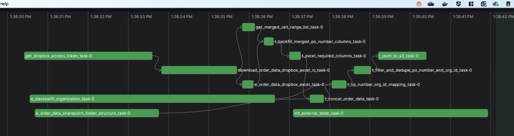
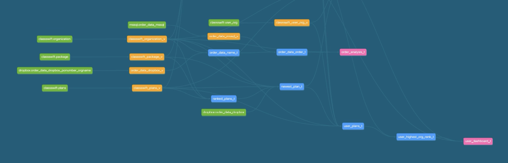
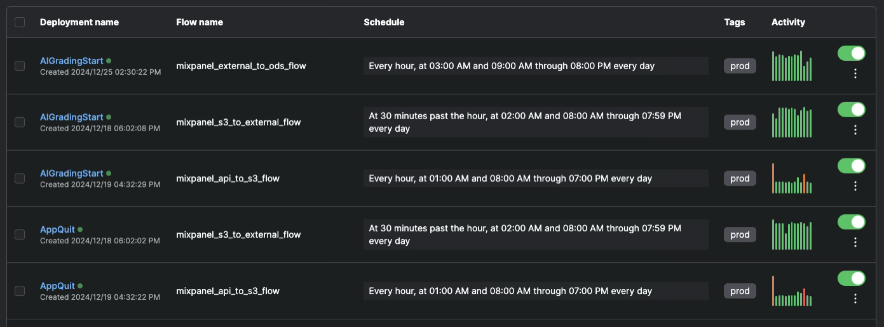
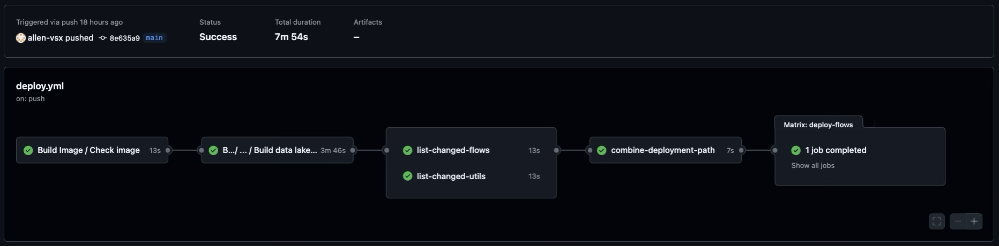
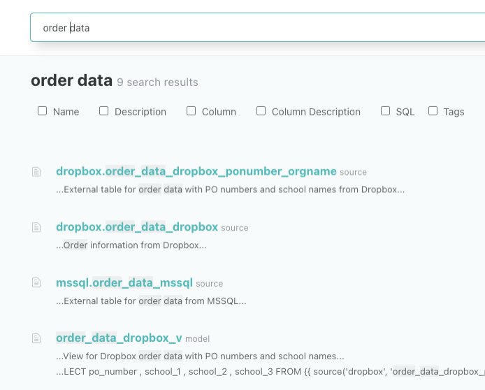
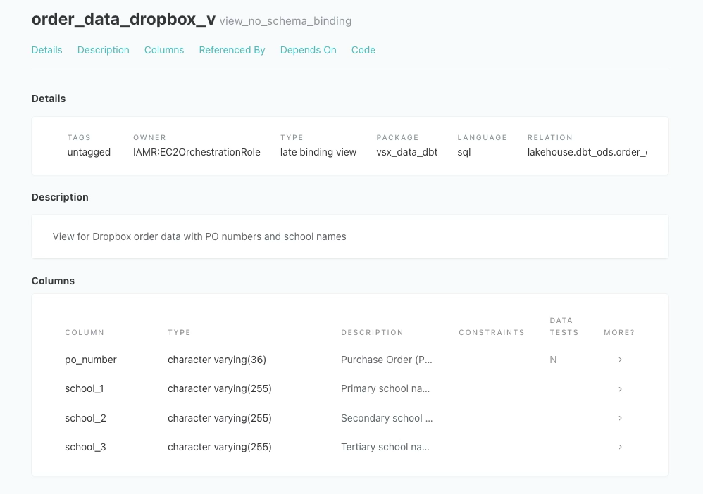

# How to Build a Reliable Data System?

When your team starts relying on data for daily operations and decision-making, **trust** becomes the foundation. But what does it mean to “trust the data”? And how do you build a system where data is accurate, timely, and easy to understand?

This article summarizes the ideas I shared in a recent internal tech talk, designed for both engineers and non-engineers alike.

<!-- truncate -->

---

## Common Data Pain Points

Many data teams struggle with issues like:

- **Inconsistent metrics across dashboards**  
  > “Why does Report A say we have 1,203 users, but Report B says 1,187?”

- **Delayed data availability**  
  > “We have a 9 AM daily meeting, but the dashboard only updates at 10 AM.”

- **Unclear definitions of metrics**  
  > “Does 'active user' mean logged in, or just visited any page?”

These issues don’t just affect data engineers—they frustrate stakeholders and erode confidence in data-driven decisions.

---

## What We Did to Fix It

To address these challenges, we introduced a few key strategies:

### 1. Data Validation and Monitoring

We added **automated data quality checks** and anomaly detection to our ETL pipeline. These checks run before data is published to dashboards or reports, so we can catch issues early.

📸 *Use slide from page 13 of PDF: "如何提升資料可信度"*

---

### 2. Automation ETL and CI/CD

We treated our data pipeline code just like application code—complete with:

- Git version control  
- Code reviews  
- Automated testing before deployment

This helped us eliminate manual scripts and improved the stability of our daily data jobs.

---

### 3. Standardized Metric Definitions

We unified naming conventions and centralized our metric logic in one place. This way, everyone—from PMs to analysts—can speak the same “data language.”

---

## Empowering Non-Engineers

Improving data quality isn’t just an engineering problem. Here's how **non-technical stakeholders** can help:

- Understand and apply **basic sanity checks** (e.g., does the number look unusually high/low?)
- Provide **detailed bug reports**, like:
  - Report name
  - Filter conditions
  - Time range affected

---

## Final Thoughts

Data pipelines are not just technical infrastructure—they're **products** that require testing, communication, and ownership. The goal isn’t perfection, but progress: one improvement at a time, built on top of **clear processes and collaborative culture**.

If your team is also working toward more reliable data, I’d love to hear from you. What strategies or tools have worked for you?

---

*Thanks for reading! If you found this article helpful, feel free to connect with me on [LinkedIn](https://www.linkedin.com/in/chengyou-shi/).*