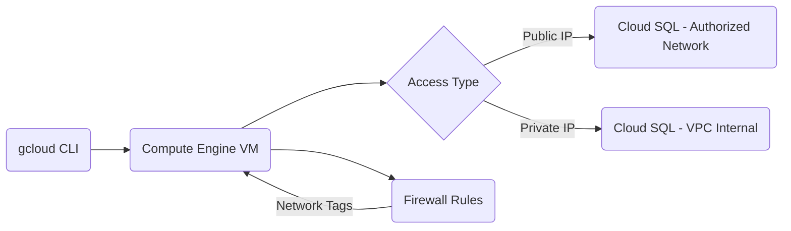

# Core Infrastructure: Compute, SQL & Networking

This page covers the foundational GCP services you'll use most often: the CLI, virtual machines, firewall rules, and managed databases.

## Google Cloud CLI (gcloud)

The `gcloud` CLI is the main tool for managing GCP resources from the terminal. Think of it as the GCP equivalent of the AWS CLI.

- **Authentication**: Run `gcloud auth login` to authenticate and set your active project.
- **Default config**: Set a default region and zone so you don't have to repeat them in every command.

```bash
gcloud auth login
gcloud config set project YOUR_PROJECT_ID
gcloud config set compute/region asia-east1
gcloud config set compute/zone asia-east1-b
```

## Compute Engine (Virtual Machines)

Compute Engine lets you run VMs on Google's infrastructure. It is the GCP equivalent of AWS EC2.

### Instance Management

You can create instances with custom CPU and memory configurations through the console or CLI.

```bash
gcloud compute instances create my-vm \
  --machine-type=e2-medium \
  --zone=asia-east1-b \
  --image-family=debian-11 \
  --image-project=debian-cloud
```

### Remote Access

There are three ways to connect to a VM:

- **Console SSH button**: Quickest option, no setup needed.
- **gcloud command**: `gcloud compute ssh INSTANCE_NAME --zone=ZONE`
- **Custom SSH key**: Add your public key to the VM for direct SSH access.

### VS Code Integration

You can use VS Code with the **Remote - SSH** extension to develop directly on the VM, similar to how dev-containers work locally. This is useful when you need more compute power or want to keep the environment consistent.

## Networking: Firewall Rules

Firewall rules control inbound and outbound traffic to your VM instances. They work like AWS Security Groups.

- **Rules**: Define allowed protocols (TCP, UDP, ICMP) and port numbers.
- **Targeting**: Apply rules to the whole VPC or to specific instances using network tags.

Common ports to open:

| Port | Protocol | Use Case |
|------|----------|----------|
| 22   | TCP      | SSH      |
| 80   | TCP      | HTTP     |
| 443  | TCP      | HTTPS    |
| 3306 | TCP      | MySQL    |

```bash
gcloud compute firewall-rules create allow-mysql \
  --allow=tcp:3306 \
  --target-tags=db-server \
  --description="Allow MySQL access"
```

## Cloud SQL (Managed Relational Database)

Cloud SQL is a fully managed database service that supports MySQL, PostgreSQL, and SQL Server. It is the GCP equivalent of AWS RDS.

### Instance Setup

When creating a Cloud SQL instance, you choose between:

- **High Availability (Regional)**: Automatic failover across zones, best for production.
- **Single Zone**: Lower cost, fine for development or non-critical workloads.

### Connectivity

- **Public IP**: Connect from outside GCP by adding your IP to the authorized networks list.
- **Private IP**: Connect within a VPC without exposing the database to the internet.

### Maintenance

Google handles automated backups and patch management for you, so you don't need to manage these manually.


