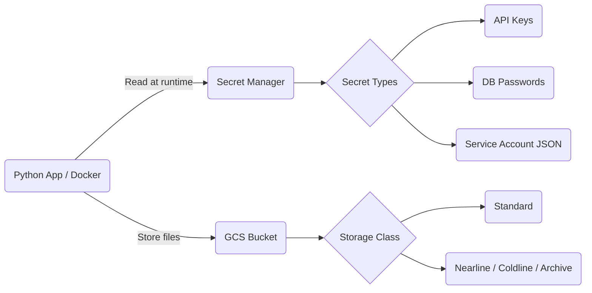

# Cloud Storage & Secret Manager

This page covers how to store unstructured data with Google Cloud Storage and how to manage sensitive credentials with Secret Manager.

## Google Cloud Storage (GCS)

GCS is an object storage service built for high durability and scalability. It is the GCP equivalent of AWS S3. You organize data into **buckets**, and each bucket has a storage class based on how often you access the data.

### Storage Classes

| Class    | Use Case                              |
|----------|---------------------------------------|
| Standard | Frequently accessed data              |
| Nearline | Accessed roughly once a month         |
| Coldline | Accessed roughly once a quarter       |
| Archive  | Long-term backup, rarely accessed     |

### gsutil CLI

`gsutil` is the command-line tool for interacting with GCS.

```bash
# Copy a file from local to GCS
gsutil cp local_file.csv gs://my-bucket/path/

# Copy from GCS to local
gsutil cp gs://my-bucket/path/file.csv ./

# Sync a local directory to a bucket (with deletion)
gsutil rsync -d local_dir/ gs://my-bucket/path/
```

### Access Control

- **IAM roles**: Control who can read or write to buckets at the project level.
- **Signed URLs**: Generate temporary URLs to give time-limited access to specific objects without requiring a GCP account.

## Secret Manager

Secret Manager is a secure place to store sensitive information like API keys, passwords, and service account credentials. Instead of hardcoding credentials in your code, you pull them at runtime.

### Why Use It

If you put credentials directly in your code or `.env` files, it is easy to accidentally commit them to Git. Secret Manager keeps secrets out of version control entirely.

### How It Works in Practice

For Python or Docker applications, secrets are usually mapped to environment variables at runtime:

```python
from google.cloud import secretmanager

client = secretmanager.SecretManagerServiceClient()
name = "projects/MY_PROJECT/secrets/MY_SECRET/versions/latest"
response = client.access_secret_version(request={"name": name})
secret_value = response.payload.data.decode("UTF-8")
```

For Docker deployments, you can pass the secret as an environment variable:

```bash
export GOOGLE_APPLICATION_CREDENTIALS=$(gcloud secrets versions access latest --secret=my-sa-key)
```

### Secret Versioning

Secrets support versioning. When you rotate a credential, you add a new version. Old versions stay available until you disable or delete them, so existing services keep working during the transition.

## Security Best Practices

- **Service accounts**: Create dedicated service accounts for each pipeline or application. Give each account only the permissions it actually needs (Least Privilege).
- **Never commit key files**: Do not put JSON key files into Git. Use Secret Manager or workload identity federation instead.
- **Rotate regularly**: Update secrets on a schedule and use versioning to avoid downtime during rotation.


