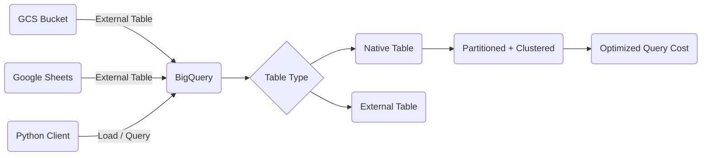

# BigQuery: Data Engineering & Governance

BigQuery is Google's serverless data warehouse. It is the GCP equivalent of AWS Redshift or Athena. This page covers table types, query optimization, and how to interact with BigQuery from Python.

## Table Types

BigQuery supports several table architectures, each with different trade-offs between cost and performance.

### Native Tables

Data is stored directly in BigQuery's columnar storage format. This gives you the best query performance and is the default choice for analytical workloads.

### External Tables

Data stays in an external source. BigQuery queries it in place without importing it. This is useful when you want to avoid duplication or when the data is already managed elsewhere.

- **GCS External Tables**: Query CSV, Parquet, or JSON files stored in Cloud Storage buckets. Good for large raw datasets.
- **Google Sheets External Tables**: Query a Google Sheet directly as a table. Useful for config tables or small datasets managed by non-technical teammates.

## Partitioning & Clustering

Large tables can get expensive to query. Partitioning and clustering help BigQuery scan less data.

### Partitioning

Partitioning splits a table into smaller segments so queries only scan the relevant portion.

- **Ingestion-Time Partitioning**: BigQuery automatically partitions by the date data is loaded. You can filter with `_PARTITIONDATE`.
- **Column-Based Partitioning**: Partition by a specific `DATE` or `TIMESTAMP` column in your data.

```sql
CREATE TABLE my_dataset.events
PARTITION BY DATE(event_date)
AS SELECT * FROM my_dataset.raw_events;
```

### Clustering

Clustering sorts data within each partition by one or more columns. This speeds up queries that filter on those columns (e.g., user ID, region).

```sql
CREATE TABLE my_dataset.events
PARTITION BY DATE(event_date)
CLUSTER BY user_id
AS SELECT * FROM my_dataset.raw_events;
```

## Python Integration

Data engineers typically use the BigQuery Python client library to load and query data programmatically.

### Authentication

```python
from google.oauth2 import service_account
from google.cloud import bigquery

credentials = service_account.Credentials.from_service_account_file("key.json")
client = bigquery.Client(project="my-project", credentials=credentials)
```

### Run a Query

```python
query = """
    SELECT user_id, COUNT(*) AS event_count
    FROM `my-project.my_dataset.events`
    WHERE DATE(event_date) = '2024-01-01'
    GROUP BY user_id
"""
df = client.query(query).to_dataframe()
```

### Google Sheets Integration

Use `pygsheets` to read data from Google Sheets and load it into BigQuery. This is a common pattern for automated reporting pipelines where business users update a sheet and the pipeline picks it up.

```python
import pygsheets
from google.cloud import bigquery

gc = pygsheets.authorize(service_file="key.json")
sheet = gc.open("My Sheet").worksheet_by_title("Sheet1")
df = sheet.get_as_df()

client = bigquery.Client()
job = client.load_table_from_dataframe(df, "my-project.my_dataset.config_table")
job.result()
```


