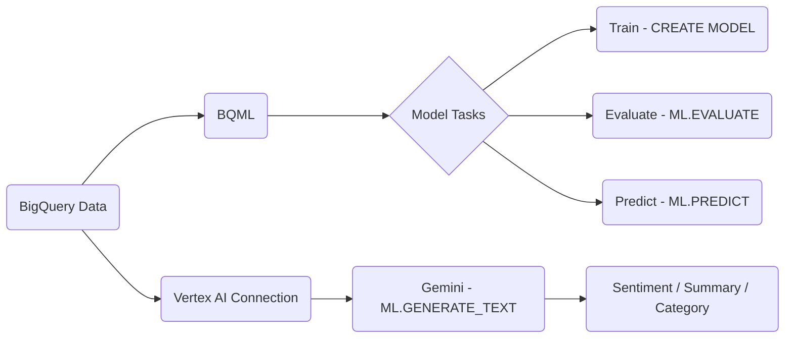

# Machine Learning & AI: BQML & Vertex AI

GCP lets you run machine learning and generative AI directly in your data environment. This page covers BigQuery ML for SQL-based modeling and Vertex AI for LLM integration.

## BigQuery ML (BQML)

BQML lets you build and run ML models using standard SQL. You don't need to export data or set up a separate training environment. The model lives inside BigQuery alongside your data.

### Training a Model

Use `CREATE MODEL` with a model type. For binary classification (e.g., predicting whether a user will purchase), use `LOGISTIC_REG`.

```sql
CREATE OR REPLACE MODEL my_dataset.purchase_model
OPTIONS(model_type='LOGISTIC_REG', input_label_cols=['purchased'])
AS
SELECT
  user_id,
  session_duration,
  page_views,
  purchased
FROM my_dataset.user_sessions
WHERE DATE(event_date) < '2024-01-01';
```

BQML automatically handles:

- **Null imputation**: Fills missing values with column means.
- **One-hot encoding**: Converts string columns into numeric features.
- **Standardization**: Normalizes numerical features.

### Evaluating the Model

```sql
SELECT *
FROM ML.EVALUATE(MODEL my_dataset.purchase_model,
  (SELECT * FROM my_dataset.user_sessions WHERE DATE(event_date) >= '2024-01-01')
);
```

Key metrics to check: **Accuracy**, **ROC AUC**, **Precision**, **Recall**.

### Making Predictions

```sql
SELECT *
FROM ML.PREDICT(MODEL my_dataset.purchase_model,
  (SELECT * FROM my_dataset.new_users)
);
```

### Feature Importance

Inspect model weights to understand which features drive predictions most.

```sql
SELECT *
FROM ML.WEIGHTS(MODEL my_dataset.purchase_model)
ORDER BY ABS(weight) DESC;
```

## Vertex AI Integration

Vertex AI is Google's platform for more advanced AI workloads. One powerful use case is connecting BigQuery to Vertex AI so you can run LLMs directly on your data using SQL.

### Setting Up a Remote Connection

First, create a remote connection between BigQuery and Vertex AI in the console or with the `bq` CLI. This lets BigQuery call Vertex AI models as if they were SQL functions.

### Gemini on BigQuery

Once the connection is set up, use `ML.GENERATE_TEXT` to call a Gemini model from a SQL query.

```sql
SELECT
  feedback_id,
  ML.GENERATE_TEXT(
    MODEL my_dataset.gemini_model,
    CONCAT(
      'Analyze this customer feedback and return: sentiment (positive/negative/neutral), ',
      'main topic, and a one-sentence summary.\n\nFeedback: ', feedback_text
    ),
    STRUCT(0.2 AS temperature, 1024 AS max_output_tokens)
  ) AS ai_analysis
FROM my_dataset.customer_feedback;
```

This is useful for:

- **Sentiment analysis** on customer reviews or support tickets.
- **Text summarization** at scale without leaving BigQuery.
- **Category extraction** from unstructured logs.

## Practical Applications

- **Purchase propensity model**: Predict which users are likely to convert and pass the results to your marketing team.
- **NL to SQL agent**: Build an agent that takes a natural language question and generates a BigQuery SQL query using Gemini.
- **Behavior log categorization**: Automatically tag user actions by category without manual labeling.


