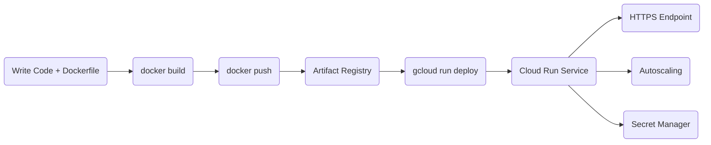

# DevOps & Deployment: Containers, Registry & Cloud Run

This page covers how to containerize a Python application, push the image to GCP, and deploy it as a serverless service using Cloud Run.

## Artifact Registry

Artifact Registry is where you store Docker images on GCP. It replaced Google Container Registry (GCR) and supports multiple artifact types including Docker images and Python packages.

### Setting Up a Repository

Create a repository scoped to a region (e.g., `asia-east1`):

```bash
gcloud artifacts repositories create my-repo \
  --repository-format=docker \
  --location=asia-east1 \
  --description="Docker image repository"
```

### Authenticate Docker

Before pushing images, authenticate Docker with your GCP credentials:

```bash
gcloud auth configure-docker asia-east1-docker.pkg.dev
```

### Build and Push an Image

Tag your image using the registry URL structure, then push it:

```bash
docker build -t asia-east1-docker.pkg.dev/MY_PROJECT/my-repo/my-app:latest .
docker push asia-east1-docker.pkg.dev/MY_PROJECT/my-repo/my-app:latest
```

## Cloud Run

Cloud Run is a fully managed serverless platform for running containerized applications. You deploy a container image and GCP handles everything else: scaling, HTTPS, and infrastructure.

### Key Characteristics

- **Stateless**: The container must not rely on local disk state between requests.
- **Port**: The app must listen on port `8080` by default (or set via the `PORT` env variable).
- **Autoscaling**: Scales from zero to many instances automatically based on traffic. You only pay when requests are being handled.
- **HTTPS**: Every Cloud Run service gets a built-in HTTPS endpoint.

### Deploy a Service

```bash
gcloud run deploy my-service \
  --image=asia-east1-docker.pkg.dev/MY_PROJECT/my-repo/my-app:latest \
  --region=asia-east1 \
  --platform=managed \
  --allow-unauthenticated \
  --set-env-vars="DB_HOST=YOUR_DB_IP,DB_NAME=mydb"
```

For secrets, reference Secret Manager instead of hardcoding values:

```bash
--set-secrets="DB_PASSWORD=my-db-password:latest"
```

## Full Workflow

The typical workflow from code to production looks like this:

1. **Build**: Write your application and create a `Dockerfile`.
2. **Store**: Build the Docker image and push it to Artifact Registry.
3. **Deploy**: Deploy the image to Cloud Run with the right environment variables.

```dockerfile
FROM python:3.11-slim

WORKDIR /app
COPY requirements.txt .
RUN pip install --no-cache-dir -r requirements.txt

COPY . .

CMD ["python", "main.py"]
```


