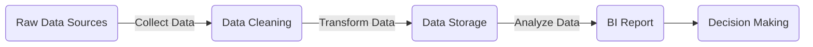

# What is ETL?

## E - Extract

Extract raw data from various sources. Data sources may include Logs, Databases, APIs, Crawlers, Local Files, Google Sheets, etc.

- **Structured Data**
    - RDB, tabular data
- **Semi-Structured Data**
    - JSON, XML, YAML
- **Unstructured Data**
    - Text files, Excel sheets

## T - Transform

Any processing performed on the data is considered a transformation.

- Examples: Filling nulls, dropping nulls, normalization, aggregation, etc.

## L - Load

Store the processed data into the target destination, similar to the sources mentioned in Extract.

---

# Data Pipeline

- **Extract**
    - **Data Sources:** Logs, Databases, APIs, Local Files, Google Sheets, etc.
- **Transform**
    - **Data Cleaning:** Clean the collected data by removing incomplete or incorrect data.
    - **Data Transformation:** Convert cleaned data into a format suitable for analysis, often stored in relational databases.
- **Load**
    - **Data Storage:** Store the transformed data in a location (e.g., a database) accessible to analysts for further analysis.
- **Application**
    - **BI Reports:** Analyze the stored data to produce BI reports or visualizations.
    - **Decision Making:** Use insights from the reports to support decision-making processes.

