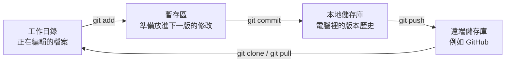

# Module 1：認識版本控制與安裝 Git

這一篇先不急著背指令。我們會先弄懂 Git 解決什麼問題，再完成安裝與第一個本地練習。

## 學完這篇，你可以

- 說明版本控制和一般檔案備份的差別。
- 分辨工作目錄、暫存區、本地儲存庫與遠端儲存庫。
- 安裝 Git，完成姓名與 Email 設定。
- 建立第一個本地 Git 儲存庫（repository，簡稱 repo）。
- 註冊 GitHub 帳號，準備下一個 module 的遠端操作。

## 為什麼需要版本控制？

如果沒有版本控制，專案很容易出現這些檔名：

```text
report.docx
report_最新版.docx
report_最新版_真的最終版.docx
report_最新版_真的最終版_2.docx
```

這種做法雖然也是備份，但很難回答：

- 昨天到底改了什麼？
- 哪一版可以正常運作？
- 是誰改了這一行？為什麼要改？
- 兩個人同時修改後，要怎麼合併？

Git 會把每次確認完成的修改保存成一個 **commit**。你可以把 commit 想成「有編號、有作者、有說明的專案快照」。

| 一般複製檔案 | Git 版本控制 |
|---|---|
| 靠檔名分辨版本 | 每個 commit 都有唯一編號 |
| 不容易知道修改內容 | 可以逐行比較差異 |
| 多人修改後難以整合 | 可以使用分支與合併 |
| 通常只能還原整份檔案 | 可以找回特定版本或特定檔案 |

## Git 的四個位置

Git 初學者最常卡住的地方，不是指令，而是不知道檔案目前在哪個位置。



- **工作目錄（working directory）**：你平常開啟、編輯檔案的資料夾。
- **暫存區（staging area）**：挑選哪些修改要放進下一個 commit。
- **本地儲存庫（local repository）**：保存在你電腦中的 commit 歷史。
- **遠端儲存庫（remote repository）**：放在 GitHub 等平台、可供備份與協作的儲存庫。

:::info 先記住這條路線

編輯檔案 → `git add` → `git commit` → `git push`

:::

## Step 1：安裝 Git

### Windows

1. 前往 [Git 官方下載頁](https://git-scm.com/downloads)。
2. 下載 Git for Windows 並執行安裝程式。
3. 初次學習可保留預設選項。
4. 安裝完成後，從開始功能表開啟 **Git Bash**。

### macOS

開啟「終端機」，輸入：

```bash
git --version
```

若系統提示安裝 Command Line Tools，依畫面完成安裝。也可以從 [Git 官方下載頁](https://git-scm.com/download/mac) 選擇其他安裝方式。

### Ubuntu / Debian Linux

```bash
sudo apt update
sudo apt install git
```

其他 Linux 發行版請參考 [Git 官方 Linux 安裝說明](https://git-scm.com/download/linux)。

## Step 2：確認安裝成功

在 Git Bash 或終端機輸入：

```bash
git --version
```

只要看到類似以下內容，就代表安裝成功；版本號不同是正常的。

```text
git version 2.x.x
```

## Step 3：設定開發者身分

每個 commit 都會記錄作者。請把範例換成自己的資料：

```bash
git config --global user.name "Your Name"
git config --global user.email "you@example.com"
git config --global init.defaultBranch main
```

查看設定：

```bash
git config --global --list
```

:::tip Email 怎麼選？

如果未來會把程式碼放到 GitHub，可使用 GitHub 帳號中的 Email；在意隱私時，也可以使用 GitHub 提供的 `noreply` Email。

:::

## Step 4：建立第一個本地儲存庫

以下指令會建立一個全新的練習資料夾，不會碰到你原本的專案。

```bash
mkdir git-practice
cd git-practice
git init -b main
```

成功時會看到類似 `Initialized empty Git repository` 的訊息。資料夾內還會多出隱藏的 `.git` 目錄，Git 的版本資料就保存在這裡。

建立第一個檔案：

```bash
echo "My first Git project" > README.md
git status
```

此時 `README.md` 會出現在 `Untracked files` 下方，表示檔案存在，但 Git 還沒有開始追蹤它。先保留這個狀態；Module 4 會帶你完成 `add` 與 `commit`。

## Step 5：註冊 GitHub 帳號

Git 本身不需要帳號也能使用；但後續要把 repository 放到 GitHub，因此先完成帳號準備：

1. 前往 [GitHub](https://github.com/) 並選擇 **Sign up**。
2. 填寫 Email、密碼與使用者名稱。
3. 完成 Email 驗證。
4. 建議開啟兩步驟驗證（2FA），替帳號多加一層保護。

## 快速自我檢查

請確認你能回答以下問題：

1. `git add` 是把修改送到哪裡？
2. `git commit` 會把版本保存在哪裡？
3. 只完成 commit，GitHub 上會立刻看到修改嗎？

答案依序是：暫存區、本地儲存庫、不會（還需要 `git push`）。

## 指令小抄

| 指令 | 用途 |
|---|---|
| `git --version` | 查看 Git 是否已安裝 |
| `git config --global --list` | 查看使用者層級設定 |
| `git init -b main` | 在目前資料夾建立 Git 儲存庫 |
| `git status` | 查看目前檔案與 Git 的狀態 |

下一篇會建立 GitHub 儲存庫，並讓本地 Git 能以 SSH 安全連線到 GitHub。
