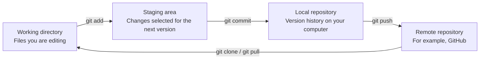

# Module 1: Version Control and Git Setup

Before memorizing commands, let's understand the problems Git solves. Then we will install Git and create a local practice repository.

## What you will learn

- Explain the difference between version control and ordinary file backups.
- Distinguish the working directory, staging area, local repository, and remote repository.
- Install Git and configure your name and email address.
- Create your first local Git repository, often shortened to **repo**.
- Register a GitHub account for the remote exercises in the next module.

## Why do we need version control?

Without version control, a project can quickly end up with files like these:

```text
report.docx
report_latest.docx
report_latest_really_final.docx
report_latest_really_final_2.docx
```

Copying files does create backups, but it does not answer important questions:

- What exactly changed yesterday?
- Which version works correctly?
- Who changed this line, and why?
- How should changes from two people be combined?

Git saves each confirmed set of changes as a **commit**. Think of a commit as a project snapshot with a unique ID, an author, and a description.

| Copying files manually | Git version control |
|---|---|
| Versions are identified by file names | Every commit has a unique ID |
| Changes are difficult to identify | Differences can be compared line by line |
| Work from multiple people is difficult to combine | Branches and merges support collaboration |
| Usually restores an entire copied file | Can recover a specific version or file |

## The four places in Git

The hardest part for many Git beginners is not the commands. It is understanding where a change currently lives.



- **Working directory**: the folder containing the files you open and edit.
- **Staging area**: the place where you select changes for the next commit.
- **Local repository**: the commit history stored on your computer.
- **Remote repository**: a repository hosted on a service such as GitHub for backup and collaboration.

:::info Remember this path

Edit files → `git add` → `git commit` → `git push`

:::

## Step 1: Install Git

### Windows

1. Open the [official Git download page](https://git-scm.com/downloads).
2. Download Git for Windows and run the installer.
3. Beginners can keep the default installation options.
4. When installation finishes, open **Git Bash** from the Start menu.

### macOS

Open Terminal and enter:

```bash
git --version
```

If macOS asks you to install the Command Line Tools, follow the on-screen instructions. You can also choose another installation method from the [official Git for macOS page](https://git-scm.com/download/mac).

### Ubuntu / Debian Linux

```bash
sudo apt update
sudo apt install git
```

For other Linux distributions, see the [official Git for Linux instructions](https://git-scm.com/download/linux).

## Step 2: Verify the installation

In Git Bash or your terminal, enter:

```bash
git --version
```

If you see output like the following, Git is installed. A different version number is normal.

```text
git version 2.x.x
```

## Step 3: Configure your developer identity

Every commit records its author. Replace the example values with your own information:

```bash
git config --global user.name "Your Name"
git config --global user.email "you@example.com"
git config --global init.defaultBranch main
```

Review the configuration:

```bash
git config --global --list
```

:::tip Which email address should I use?

If you plan to publish code on GitHub, you can use an email associated with your GitHub account. If privacy matters, you can use the `noreply` email address provided by GitHub.

:::

## Step 4: Create your first local repository

The following commands create a new practice folder and do not touch your existing projects.

```bash
mkdir git-practice
cd git-practice
git init -b main
```

You should see a message similar to `Initialized empty Git repository`. The folder also contains a hidden `.git` directory where Git stores its version data.

Create your first file:

```bash
echo "My first Git project" > README.md
git status
```

`README.md` now appears under `Untracked files`. The file exists, but Git is not tracking it yet. Leave it in this state for now; Module 4 will guide you through `add` and `commit`.

## Step 5: Register a GitHub account

Git works without an account, but later exercises will publish a repository to GitHub. Prepare your account now:

1. Go to [GitHub](https://github.com/) and select **Sign up**.
2. Enter your email address, password, and username.
3. Complete email verification.
4. Enable two-factor authentication (2FA) to add another layer of account protection.

## Quick self-check

Make sure you can answer these questions:

1. Where does `git add` send your changes?
2. Where does `git commit` save a version?
3. Does a commit immediately appear on GitHub?

The answers are: the staging area, the local repository, and no—you still need `git push`.

## Command reference

| Command | Purpose |
|---|---|
| `git --version` | Check whether Git is installed |
| `git config --global --list` | Show user-level configuration |
| `git init -b main` | Create a Git repository in the current folder |
| `git status` | Show the current file and Git status |

In the next module, you will create a GitHub repository and connect your local Git repository securely over SSH.
