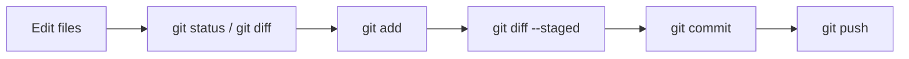

# Module 4: Commits, .gitignore, and Push

This module covers the most important daily Git cycle: inspect the state, select changes, create a commit, and push it to GitHub.



## Before you begin

Enter the repository you cloned in Module 2:

```bash
cd ~/git-projects/git-practice-remote
git status
```

Confirm that you are on `main` and that there are no unexpected changes. If your project is elsewhere, use its actual path.

## Step 1: Edit a file and inspect its status

Append one line to `README.md`:

```bash
echo "Learning Git step by step." >> README.md
git status
```

`modified: README.md` means the file in your working directory differs from the last commit.

See exactly which lines changed:

```bash
git diff
```

In a diff:

- A line beginning with `+` was added.
- A line beginning with `-` was removed.
- These are diff markers, not part of the file's actual content.

## Step 2: Add the change to the staging area

```bash
git add README.md
git status
```

The file now appears under `Changes to be committed`. Before committing, inspect what the next commit will contain:

```bash
git diff --staged
```

:::tip Why not use `git add .` immediately?

`git add .` stages every change below the current directory. As a beginner, naming the file explicitly helps prevent test files, secrets, or unrelated changes from entering the commit.

:::

### If you staged the wrong file

Remove the file from the staging area while keeping the working-directory changes:

```bash
git restore --staged README.md
```

After reviewing it, you can run `git add README.md` again.

## Step 3: Create a commit

```bash
git commit -m "docs: add Git learning note"
```

A useful commit message briefly explains what the version accomplishes. For example:

- `docs: update installation guide`
- `feat: add login form`
- `fix: handle empty username`

Check the result:

```bash
git status
git log --oneline --decorate -5
```

`working tree clean` means every current change has been committed.

## Step 4: Use `.gitignore`

Some files should not be added to version control, including:

- Password or secret files such as `.env`
- Installed dependencies such as `node_modules/`
- Python cache directories such as `__pycache__/`
- Operating-system files such as `.DS_Store`
- Build output or large temporary files

Create `.gitignore`:

```gitignore title=".gitignore"
.env
node_modules/
__pycache__/
*.pyc
.DS_Store
```

Then create a version:

```bash
git add .gitignore
git diff --staged
git commit -m "chore: add ignore rules"
```

### Already tracked files are not ignored automatically

If a file was committed before it was added to `.gitignore`, stop tracking it while keeping the local file:

```bash
git rm --cached <file>
git commit -m "chore: stop tracking generated file"
```

If a secret has already been pushed, deleting the current file is not enough. Revoke or rotate the secret immediately, then handle the repository history separately.

## Step 5: Inspect an older version without changing history

Find a commit ID:

```bash
git log --oneline
```

Temporarily inspect that version:

```bash
git switch --detach <commit-id>
```

Return to `main` when finished:

```bash
git switch main
```

A `detached HEAD` is useful for inspecting an old version, but not for long-term development. To keep new work based on an old version, create a branch:

```bash
git switch -c experiment-from-old-version <commit-id>
```

## Step 6: Push to GitHub

```bash
git push -u origin main
```

- `origin`: the default name of the remote repository.
- `main`: the local branch to push.
- `-u`: links local `main` to `origin/main`; later, `git push` is usually enough.

After the push succeeds, refresh the repository page on GitHub. You should see the README, `.gitignore`, and latest commits.

## Restore an uncommitted change

To discard changes to one file in the working directory:

```bash
git restore <file>
```

:::warning This discards content

`git restore <file>` replaces your current changes with the version from the last commit. Run `git diff` first and make sure you no longer need the changes.

:::

## Pre-commit checklist

```bash
git status
git diff
git add <file>
git diff --staged
git commit -m "Clearly describe the change"
git status
```

When the change should be synchronized to GitHub, run:

```bash
git push
```

## Command reference

| Command | Purpose |
|---|---|
| `git diff` | Show differences that are not staged |
| `git add <file>` | Stage selected changes |
| `git diff --staged` | Show what the next commit will contain |
| `git commit -m "..."` | Create a local version |
| `git log --oneline` | Show a compact version history |
| `git push -u origin main` | Push for the first time and set the upstream |
| `git restore --staged <file>` | Unstage a file but keep its changes |
| `git restore <file>` | Discard uncommitted changes to a file |
