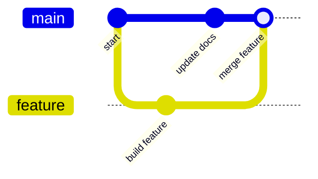

# Module 5：分支、Merge 與衝突處理

分支（branch）讓不同工作擁有各自的版本路線。你可以在功能分支放心修改，完成並確認後，再把它合併回 `main`。



## 分支適合解決什麼問題？

- 新功能還沒完成，不想影響穩定版本。
- 多人同時開發不同功能。
- 需要緊急修正線上問題。
- 想先實驗一個想法，成功後再保留。

## Step 1：查看目前分支

進入練習 repository：

```bash
cd ~/git-projects/git-practice-remote
git status
git branch
```

`*` 表示目前所在分支。也可以只顯示分支名稱：

```bash
git branch --show-current
```

開始前，先確認工作目錄乾淨。如果還有修改，先 commit，或確認它們與本次練習無關後妥善保存。

## Step 2：建立並切換到功能分支

```bash
git switch -c feature/greeting
```

這一行同時完成：

1. 從目前版本建立 `feature/greeting`。
2. 切換到新分支。

確認位置：

```bash
git branch --show-current
```

舊版教材常見 `git checkout -b feature/greeting`；效果相近，但 `git switch -c` 的用途更清楚，較適合初學者。

## Step 3：在功能分支建立版本

```bash
echo "Hello from the feature branch." > greeting.txt
git add greeting.txt
git commit -m "feat: add greeting"
```

把新分支推到 GitHub：

```bash
git push -u origin feature/greeting
```

## Step 4：合併回 Main

先切回要接收修改的分支，再執行 merge：

```bash
git switch main
git merge feature/greeting
```

檢查結果：

```bash
git log --oneline --graph --decorate --all
git status
```

合併成功後推送：

```bash
git push
```

:::info Merge 的方向

「把 `feature/greeting` 合併進 `main`」時，要先站在 `main`，再執行 `git merge feature/greeting`。

:::

## Fast-forward 與 Merge Commit

- **Fast-forward**：`main` 在分支建立後沒有其他新 commit，Git 只需把指標往前移。
- **Merge commit**：兩條分支都往前發展，Git 需要建立一個新 commit 連接兩邊歷史。

兩者都可能是正常結果，不需要為了看到哪一種訊息而重做操作。

## Step 5：親手製造並解決衝突

衝突通常發生在兩個分支修改了同一檔案的同一區域，而 Git 無法判斷該保留哪一邊。

### 5-1 建立共同起點

先在 `main` 建立一個檔案：

```bash
git switch main
echo "color=blue" > settings.txt
git add settings.txt
git commit -m "chore: add color setting"
```

從這裡建立功能分支：

```bash
git switch -c feature/change-color
echo "color=red" > settings.txt
git add settings.txt
git commit -m "feat: use red color"
```

### 5-2 在 Main 修改同一行

```bash
git switch main
echo "color=green" > settings.txt
git add settings.txt
git commit -m "fix: use green color"
```

### 5-3 進行合併

```bash
git merge feature/change-color
```

此時 Git 應回報 conflict。先查看：

```bash
git status
```

`settings.txt` 會包含類似標記：

```text
 <<<<<<< HEAD
 color=green
 =======
 color=red
 >>>>>>> feature/change-color
```

- `HEAD` 這側是目前所在的 `main`。
- 分隔線下方是要合併進來的 `feature/change-color`。
- Git 不會替團隊決定正確內容，必須由人理解需求後選擇。

### 5-4 編輯成最後結果

假設討論後決定用紫色，將檔案改成只剩：

```text title="settings.txt"
color=purple
```

接著標記衝突已解決並完成合併：

```bash
git add settings.txt
git status
git commit -m "merge: resolve color setting conflict"
```

確認沒有殘留衝突符號：

```bash
git grep -n -e '<<<<<<<' -e '=======' -e '>>>>>>>'
```

沒有輸出表示 Git 追蹤的檔案中沒有找到這些標記。

### 不想繼續解衝突

在尚未完成 merge commit 前，可以回到合併前：

```bash
git merge --abort
```

## Step 6：刪除已完成分支

確認功能已合併且目前不在該分支：

```bash
git switch main
git branch -d feature/greeting
```

刪除遠端分支：

```bash
git push origin --delete feature/greeting
```

`-d` 會在分支尚未合併時阻止刪除。`-D` 會強制刪除，初學時不要因為 `-d` 失敗就立刻改用 `-D`，應先確認分支是否還有需要保留的 commit。

## 常見問題

### 切換分支時被阻止

通常是未提交修改會被覆蓋。先執行：

```bash
git status
git diff
```

再選擇 commit、暫存到 stash，或在確定不需要時還原修改。

### 合併了錯的方向

先不要 push。記下當前訊息與 `git status`，再判斷是尚在 merge 過程可 `git merge --abort`，還是已建立 merge commit。已分享的 merge commit 通常要用 `git revert -m 1 <merge-commit-id>` 反向建立一個新版本；`-m 1` 代表保留第一個父版本的主線，執行前務必用版本圖確認父版本順序。不要直接猜測並執行 `reset --hard`。

## 指令小抄

| 指令 | 用途 |
|---|---|
| `git switch -c <branch>` | 建立並切換分支 |
| `git switch <branch>` | 切換分支 |
| `git merge <branch>` | 把指定分支合併到目前分支 |
| `git merge --abort` | 放棄尚未完成的 merge |
| `git branch -d <branch>` | 安全刪除已合併的本地分支 |
| `git push origin --delete <branch>` | 刪除遠端分支 |
| `git log --graph --all --oneline` | 查看所有分支的版本圖 |
