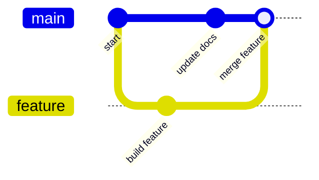

# Module 5: Branches, Merges, and Conflicts

A branch gives a piece of work its own version path. You can make changes safely on a feature branch, then merge it into `main` after it is complete and verified.



## What problems do branches solve?

- A new feature is incomplete and should not affect the stable version.
- Multiple people need to develop different features at the same time.
- A production issue needs an urgent fix.
- You want to experiment and keep the work only if it succeeds.

## Step 1: Check the current branch

Enter the practice repository:

```bash
cd ~/git-projects/git-practice-remote
git status
git branch
```

The `*` marks your current branch. You can also print only its name:

```bash
git branch --show-current
```

Make sure the working tree is clean before continuing. If it contains changes, commit them or save them appropriately before starting this exercise.

## Step 2: Create and switch to a feature branch

```bash
git switch -c feature/greeting
```

This command performs two actions:

1. Creates `feature/greeting` from the current version.
2. Switches to the new branch.

Verify your location:

```bash
git branch --show-current
```

Older tutorials often use `git checkout -b feature/greeting`. It has a similar effect, but `git switch -c` expresses the intent more clearly for beginners.

## Step 3: Create a version on the feature branch

```bash
echo "Hello from the feature branch." > greeting.txt
git add greeting.txt
git commit -m "feat: add greeting"
```

Push the new branch to GitHub:

```bash
git push -u origin feature/greeting
```

## Step 4: Merge the feature into Main

Switch to the branch that should receive the changes, then run merge:

```bash
git switch main
git merge feature/greeting
```

Inspect the result:

```bash
git log --oneline --graph --decorate --all
git status
```

After a successful merge, push it:

```bash
git push
```

:::info Merge direction

To merge `feature/greeting` **into** `main`, first stand on `main`, then run `git merge feature/greeting`.

:::

## Fast-forward and merge commits

- **Fast-forward**: `main` has no new commits since the feature branch was created, so Git only moves the branch pointer forward.
- **Merge commit**: both branches have moved forward, so Git creates a new commit connecting their histories.

Both can be normal results. You do not need to repeat the operation just to produce one type or the other.

## Step 5: Create and resolve a conflict

A conflict usually happens when two branches change the same part of the same file and Git cannot decide which result is correct.

### 5-1 Create a common starting point

First, create a file on `main`:

```bash
git switch main
echo "color=blue" > settings.txt
git add settings.txt
git commit -m "chore: add color setting"
```

Create a feature branch from that point:

```bash
git switch -c feature/change-color
echo "color=red" > settings.txt
git add settings.txt
git commit -m "feat: use red color"
```

### 5-2 Change the same line on Main

```bash
git switch main
echo "color=green" > settings.txt
git add settings.txt
git commit -m "fix: use green color"
```

### 5-3 Attempt the merge

```bash
git merge feature/change-color
```

Git should report a conflict. Inspect the state:

```bash
git status
```

`settings.txt` will contain markers similar to these:

```text
 <<<<<<< HEAD
 color=green
 =======
 color=red
 >>>>>>> feature/change-color
```

- The `HEAD` side represents the current `main` branch.
- The section below the separator comes from `feature/change-color`.
- Git cannot decide the correct business result; a person must understand the requirement and choose it.

### 5-4 Edit the final result

Suppose the team decides to use purple. Edit the file so it contains only:

```text title="settings.txt"
color=purple
```

Mark the conflict as resolved and complete the merge:

```bash
git add settings.txt
git status
git commit -m "merge: resolve color setting conflict"
```

Check for any remaining conflict markers:

```bash
git grep -n -e '<<<<<<<' -e '=======' -e '>>>>>>>'
```

No output means those markers were not found in files tracked by Git.

### If you do not want to continue resolving the conflict

Before creating the merge commit, return to the state before the merge:

```bash
git merge --abort
```

## Step 6: Delete completed branches

Make sure the work was merged and that you are no longer on the feature branch:

```bash
git switch main
git branch -d feature/greeting
```

Delete the remote branch:

```bash
git push origin --delete feature/greeting
```

`-d` refuses to delete an unmerged branch. If it fails, do not immediately replace it with `-D`. First verify whether the branch still contains commits you need to keep.

## Common problems

### Git refuses to switch branches

Uncommitted changes would usually be overwritten. First run:

```bash
git status
git diff
```

Then choose whether to commit the changes, place them in a stash, or restore them only when you are sure they are no longer needed.

### You merged in the wrong direction

Do not push yet. Save the current messages and `git status`. If the merge is still in progress, use `git merge --abort`. If a merge commit has already been shared, it is usually reversed with `git revert -m 1 <merge-commit-id>`; `-m 1` keeps the first parent as the mainline, so inspect the version graph and confirm the parent order first. Do not guess and run `reset --hard`.

## Command reference

| Command | Purpose |
|---|---|
| `git switch -c <branch>` | Create and switch to a branch |
| `git switch <branch>` | Switch branches |
| `git merge <branch>` | Merge a branch into the current branch |
| `git merge --abort` | Cancel an unfinished merge |
| `git branch -d <branch>` | Safely delete a merged local branch |
| `git push origin --delete <branch>` | Delete a remote branch |
| `git log --graph --all --oneline` | Show the version graph for all branches |
