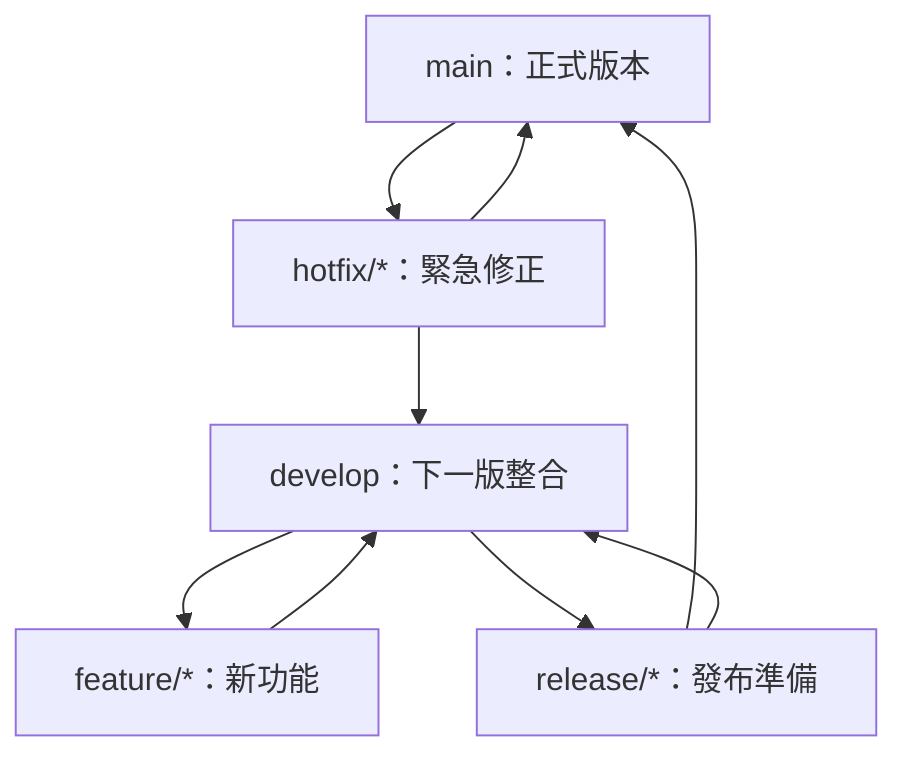

# Module 6：Git 開發流程與多人協作

Git 提供分支與合併工具，但不會規定團隊一定要怎麼合作。「開發流程」就是團隊共同約定：從哪裡開分支、修改怎麼被審查、何時可以合併與部署。

## 常見分支名稱

| 名稱 | 常見用途 | 常見起點與終點 |
|---|---|---|
| `main` | 穩定、可發布的主要版本 | 長期存在 |
| `develop` | 整合尚未發布的功能 | Git Flow 中長期存在 |
| `feature/...` | 開發單一功能 | 從 `main` 或 `develop` 開出，完成後合併 |
| `release/...` | 發布前測試與小幅修正 | 從 `develop` 開出，完成後合併 |
| `hotfix/...` | 緊急修正正式版本 | 通常從 `main` 開出 |

這些是慣例，不是 Git 的保留字。團隊也可以使用 `fix/...`、`docs/...` 或在名稱中加入任務編號，例如 `feature/123-login-page`。

## 初學者先用簡單的 GitHub Flow

小型團隊與持續部署專案常使用接近 GitHub Flow 的做法：


基本指令：

```bash
git switch main
git pull --ff-only
git switch -c feature/short-description

# 修改與測試
git add <files>
git commit -m "feat: describe the change"
git push -u origin feature/short-description
```

接著到 GitHub 建立 Pull Request（PR），請團隊成員 review。通過測試與審查後再合併。

## Pull Request 是什麼？

Pull Request 不是 Git 指令，而是 GitHub 的協作功能。它把「想合併的來源分支」與「目標分支」放在一起，讓團隊可以：

- 查看完整差異。
- 在特定程式碼行留言。
- 執行自動測試。
- 要求修改或核准。
- 保留討論與決策紀錄。

## 實作 A：你有原 Repository 寫入權限

1. 從最新 `main` 建立功能分支。
2. 在本機修改、測試、commit。
3. Push 功能分支到同一個 GitHub repository。
4. 在 GitHub 選擇 **Compare & pull request**。
5. 確認 base 是 `main`，compare 是你的功能分支。
6. 寫清楚 PR 標題、修改原因與測試方式。
7. 等待 review，通過後合併。

## 實作 B：用 Fork 參與別人的專案

沒有原 repository 寫入權限時，先 Fork 一份副本到自己的 GitHub 帳號。

### Step 1：Fork 並 Clone 自己的副本

1. 在原專案頁面選擇 **Fork**。
2. 進入自己帳號下的 fork。
3. 複製 SSH 網址並 clone：

```bash
git clone git@github.com:YOUR_ACCOUNT/PROJECT.git
cd PROJECT
```

此時 `origin` 指向你的 fork。

### Step 2：加入原專案為 upstream

```bash
git remote add upstream git@github.com:ORIGINAL_OWNER/PROJECT.git
git remote -v
```

- `origin`：你可以 push 的個人 fork。
- `upstream`：原作者的 repository，通常只用來取得更新。

### Step 3：先同步，再開功能分支

```bash
git fetch upstream
git switch main
git merge --ff-only upstream/main
git push origin main
git switch -c feature/my-change
```

### Step 4：修改並 Push

```bash
# 編輯與測試後
git add <files>
git commit -m "feat: describe my change"
git push -u origin feature/my-change
```

### Step 5：建立 Pull Request

在 GitHub 開啟自己的 fork，建立 Pull Request：

- base repository：原作者的 repository。
- base branch：通常是 `main`。
- head repository：你的 fork。
- compare branch：`feature/my-change`。

提交前先閱讀專案的 `README.md`、`CONTRIBUTING.md` 與 PR template。

## 收到 Review 後怎麼更新？

在同一個功能分支修改並再次 push，既有 PR 會自動更新：

```bash
git switch feature/my-change
# 修改檔案
git add <files>
git commit -m "fix: address review feedback"
git push
```

不需要為每一輪 review 新開 PR。

## 什麼是 Git Flow？

Git Flow 使用較完整的分支角色，適合有明確版本發布與多條維護線的產品：



典型規則：

- `feature/*` 從 `develop` 開出，完成後合併回 `develop`。
- `release/*` 用於發布前測試，不再加入大型新功能。
- `hotfix/*` 從 `main` 開出，修正後同時回到 `main` 與 `develop`。
- 任務型分支完成後刪除。

:::tip 流程越多不代表越專業

如果團隊只維護一個持續發布的版本，GitHub Flow 通常更容易遵守。只有在 release、hotfix 與多版本維護確實存在時，再採用 Git Flow。

:::

## 團隊共同約定範例

- 不直接 push 到 `main`。
- 一個分支只處理一個主題。
- commit 保持小而清楚。
- PR 說明「為什麼改、改了什麼、怎麼測」。
- 合併前至少一人 review，且自動測試通過。
- 不對其他人正在使用的共享分支任意 force push。
- 機密資訊永遠不進 Git 歷史。

## 延伸閱讀

- [GitHub：建立 Pull Request](https://docs.github.com/en/pull-requests/collaborating-with-pull-requests/proposing-changes-to-your-work-with-pull-requests/creating-a-pull-request)
- [GitHub：Fork 一個 Repository](https://docs.github.com/en/pull-requests/collaborating-with-pull-requests/working-with-forks/fork-a-repo)
- [A successful Git branching model](https://nvie.com/posts/a-successful-git-branching-model/)
