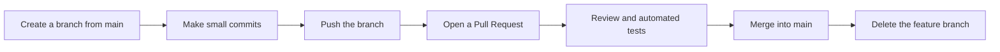
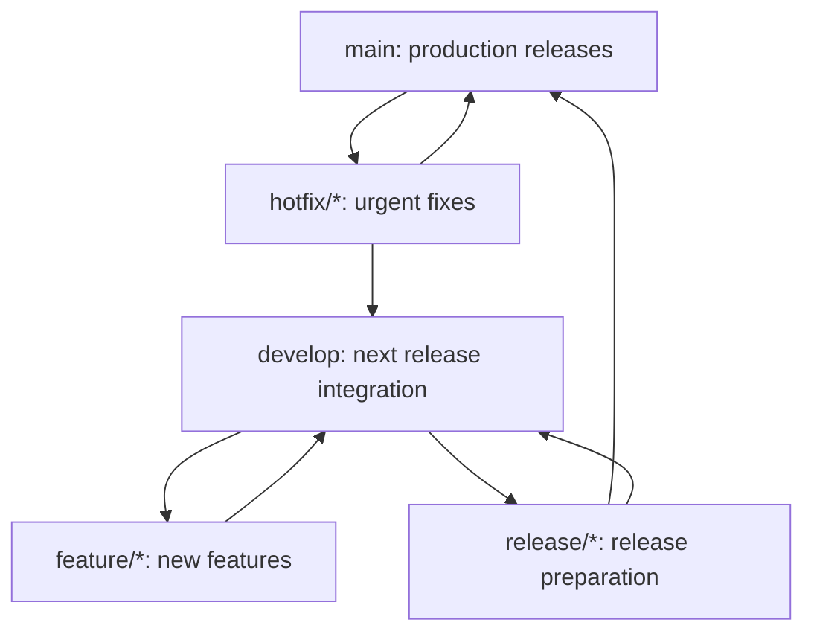

# Module 6: Git Workflows and Collaboration

Git provides branching and merging tools, but it does not prescribe how a team must collaborate. A **development workflow** is the team's shared agreement about where branches begin, how changes are reviewed, and when work can be merged or deployed.

## Common branch names

| Name | Common purpose | Typical lifecycle |
|---|---|---|
| `main` | Stable primary version that can be released | Long-lived |
| `develop` | Integrates features for a future release | Long-lived in Git Flow |
| `feature/...` | Develops one feature | Starts from `main` or `develop`, then merges back |
| `release/...` | Final testing and small fixes before a release | Starts from `develop`, then merges when ready |
| `hotfix/...` | Urgent repair for a production version | Usually starts from `main` |

These names are conventions, not reserved Git words. A team can also use `fix/...`, `docs/...`, or include a task number such as `feature/123-login-page`.

## Beginners should start with a simple GitHub Flow

Small teams and continuously deployed projects often use a workflow similar to GitHub Flow:



Basic commands:

```bash
git switch main
git pull --ff-only
git switch -c feature/short-description

# Edit and test
git add <files>
git commit -m "feat: describe the change"
git push -u origin feature/short-description
```

Next, open a Pull Request (PR) on GitHub and ask a teammate to review it. Merge only after the review and tests pass.

## What is a Pull Request?

A Pull Request is a GitHub collaboration feature, not a Git command. It puts a proposed source branch and target branch together so a team can:

- Review the complete diff.
- Comment on specific lines of code.
- Run automated tests.
- Request changes or approve the work.
- Preserve discussions and decisions.

## Exercise A: You have write access to the original repository

1. Create a feature branch from the latest `main`.
2. Edit, test, and commit locally.
3. Push the feature branch to the same GitHub repository.
4. Select **Compare & pull request** on GitHub.
5. Confirm that the base is `main` and compare is your feature branch.
6. Write a clear PR title, reason for the change, and testing instructions.
7. Wait for review and merge after approval.

## Exercise B: Contribute to another project with a fork

If you do not have write access to the original repository, first fork a copy into your GitHub account.

### Step 1: Fork and clone your copy

1. Select **Fork** on the original project page.
2. Open the fork under your own account.
3. Copy its SSH URL and clone it:

```bash
git clone git@github.com:YOUR_ACCOUNT/PROJECT.git
cd PROJECT
```

`origin` now points to your fork.

### Step 2: Add the original project as upstream

```bash
git remote add upstream git@github.com:ORIGINAL_OWNER/PROJECT.git
git remote -v
```

- `origin`: your personal fork, where you can push.
- `upstream`: the original repository, usually used to retrieve updates.

### Step 3: Synchronize before creating a feature branch

```bash
git fetch upstream
git switch main
git merge --ff-only upstream/main
git push origin main
git switch -c feature/my-change
```

### Step 4: Edit and push

```bash
# After editing and testing
git add <files>
git commit -m "feat: describe my change"
git push -u origin feature/my-change
```

### Step 5: Open a Pull Request

Open your fork on GitHub and create a Pull Request with:

- Base repository: the original owner's repository.
- Base branch: usually `main`.
- Head repository: your fork.
- Compare branch: `feature/my-change`.

Before submitting, read the project's `README.md`, `CONTRIBUTING.md`, and PR template.

## How do you update a PR after review?

Make changes on the same feature branch and push again. The existing PR updates automatically:

```bash
git switch feature/my-change
# Edit files
git add <files>
git commit -m "fix: address review feedback"
git push
```

You do not need a new PR for each round of review.

## What is Git Flow?

Git Flow defines more branch roles and is useful for products with explicit releases and multiple maintenance lines:



Typical rules include:

- `feature/*` starts from `develop` and merges back into `develop` when complete.
- `release/*` is for final testing; large new features are no longer added.
- `hotfix/*` starts from `main` and merges back into both `main` and `develop`.
- Task branches are deleted after their work is complete.

:::tip More process does not mean more professional

If a team maintains only one continuously released version, GitHub Flow is often easier to follow. Adopt Git Flow only when releases, hotfixes, and multiple maintained versions genuinely require it.

:::

## Example team agreements

- Do not push directly to `main`.
- Keep each branch focused on one topic.
- Keep commits small and clear.
- Explain why the PR exists, what changed, and how it was tested.
- Require at least one review and passing automated tests before merge.
- Do not force-push a shared branch that other people use.
- Never put secrets in Git history.

## Further reading

- [GitHub: Creating a Pull Request](https://docs.github.com/en/pull-requests/collaborating-with-pull-requests/proposing-changes-to-your-work-with-pull-requests/creating-a-pull-request)
- [GitHub: Fork a repository](https://docs.github.com/en/pull-requests/collaborating-with-pull-requests/working-with-forks/fork-a-repo)
- [A successful Git branching model](https://nvie.com/posts/a-successful-git-branching-model/)
