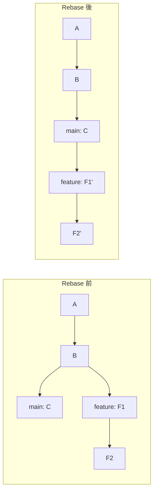
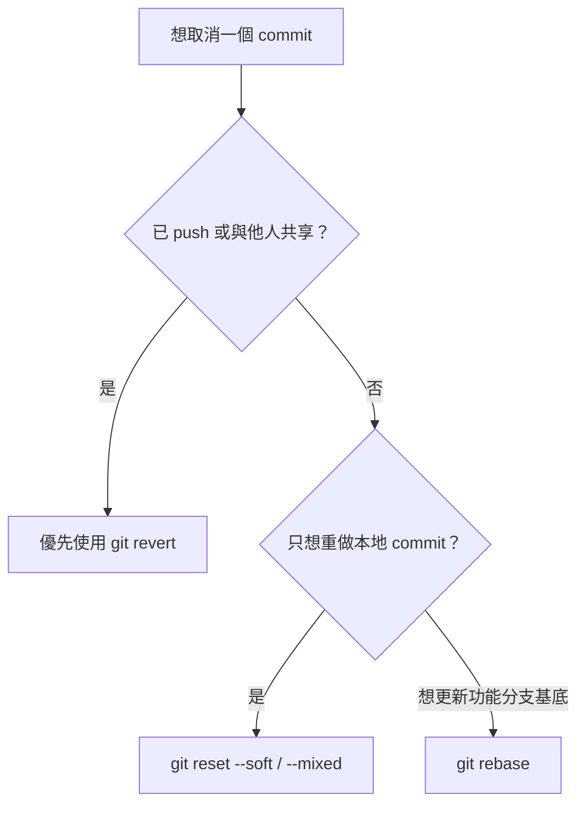

# Module 7：Revert、Reset 與 Rebase

這三組指令都會影響版本，但目的與風險完全不同：

| 指令 | 主要用途 | 會重寫既有歷史嗎？ | 初學者原則 |
|---|---|---:|---|
| `git revert` | 用新 commit 抵消舊 commit | 不會 | 已 push 的共享歷史優先用它 |
| `git reset` | 移動目前分支指標 | 會 | 只處理尚未分享的本地 commit |
| `git rebase` | 把 commit 重新接到新基底 | 會 | 只整理自己可控制的分支 |

:::danger 請使用練習 Repository

不要第一次就在重要專案練習 `reset --hard` 或 rebase。以下步驟會建立一個可隨時丟棄的本地 repository。

:::

## Step 1：建立安全練習環境

```bash
cd ~/git-projects
mkdir git-history-lab
cd git-history-lab
git init -b main

echo "line 1" > story.txt
git add story.txt
git commit -m "docs: add line 1"

echo "line 2" >> story.txt
git add story.txt
git commit -m "docs: add line 2"

echo "line 3" >> story.txt
git add story.txt
git commit -m "docs: add line 3"
```

查看三個版本：

```bash
git log --oneline --decorate
```

## Revert：用新版本安全抵消修改

要取消最後一個 commit，但保留完整紀錄：

```bash
git revert --no-edit HEAD
git log --oneline --decorate
cat story.txt
```

你會看到：

- 歷史中新增一個 `Revert ...` commit。
- 原本加入 line 3 的 commit 仍然存在。
- 最新檔案狀態不再包含 line 3。

要 revert 特定版本，先用 `git log --oneline` 找編號：

```bash
git revert <commit-id>
```

如果發生衝突，處理方式和 merge 類似：編輯檔案、`git add`，再執行 `git revert --continue`。想取消則使用：

```bash
git revert --abort
```

## Reset：移動分支指標

Reset 常用來拆掉尚未 push 的本地 commit。三種模式的差別是「commit 拆掉後，檔案修改放在哪裡」。

| 模式 | Commit | 暫存區 | 工作目錄 |
|---|---|---|---|
| `--soft` | 拆掉 | 保留修改 | 保留修改 |
| `--mixed` | 拆掉 | 取消暫存 | 保留修改 |
| `--hard` | 拆掉 | 清除 | 清除 |

### `--soft`：想重新整理 Commit

先建立一個測試 commit：

```bash
echo "draft" > draft.txt
git add draft.txt
git commit -m "wip"
git reset --soft HEAD~1
git status
```

`draft.txt` 的修改仍在暫存區，可直接用更好的訊息重新 commit：

```bash
git commit -m "docs: add draft"
```

### `--mixed`：想重新選擇要 Add 的檔案

`--mixed` 是未指定模式時的預設值：

```bash
git reset HEAD~1
git status
```

上一個 commit 被拆掉，修改留在工作目錄但不在暫存區。可重新檢查與分批加入：

```bash
git add draft.txt
git commit -m "docs: add reviewed draft"
```

### `--hard`：連未提交內容一起清除

先建立救援分支，再練習：

```bash
git branch rescue-before-hard
git reset --hard HEAD~1
git log --oneline --decorate --all
```

`--hard` 會讓暫存區與工作目錄都符合目標 commit，未保存的修改可能無法找回。這次因為先建立救援分支，可復原：

```bash
git reset --hard rescue-before-hard
```

## Reflog：尋找分支曾經指向的位置

如果 reset 或切換後找不到剛才的 commit，可先查看本地操作紀錄：

```bash
git reflog
```

找到目標 commit 後，先建立救援分支最安全：

```bash
git switch -c recovery <commit-id>
```

Reflog 只存在本機，而且紀錄會過期；它是救援工具，不是備份策略。

## Rebase：把 Commit 重新接到新的基底

假設你從較舊的 `main` 開始開發，後來 `main` 已有新 commit。Rebase 會把功能分支的 commit 暫時取下，再依序接到最新 `main` 後面。



注意 `F1'` 與 `F2'` 是重新產生的新 commit，所以編號會改變。

在功能分支執行：

```bash
git switch feature/my-change
git fetch origin
git rebase origin/main
```

若沒有衝突，功能分支會移到最新 `origin/main` 後方。若發生衝突：

```bash
# 編輯衝突檔案後
git add <resolved-files>
git rebase --continue
```

每遇到一個衝突就重複處理。想完全取消這次 rebase：

```bash
git rebase --abort
```

## Rebase 的安全規則

- 可以 rebase：尚未分享、只有自己使用的功能分支。
- 不要任意 rebase：團隊共同使用或已被其他人拉取的分支。
- Rebase 後若分支先前已 push，更新遠端可能需要 force push；先依團隊規則處理。
- 確定必須更新自己的遠端分支時，`--force-with-lease` 比 `--force` 多一層他人更新檢查，但仍應先確認分支無人共用。

```bash
git push --force-with-lease
```

## 怎麼選？



不確定時，先停止操作並保存 `git status`、`git log --oneline --graph --all` 與 `git reflog` 的結果，再決定下一步。

## 官方文件

- [git revert](https://git-scm.com/docs/git-revert)
- [git reset](https://git-scm.com/docs/git-reset)
- [git rebase](https://git-scm.com/docs/git-rebase)
- [git reflog](https://git-scm.com/docs/git-reflog)
