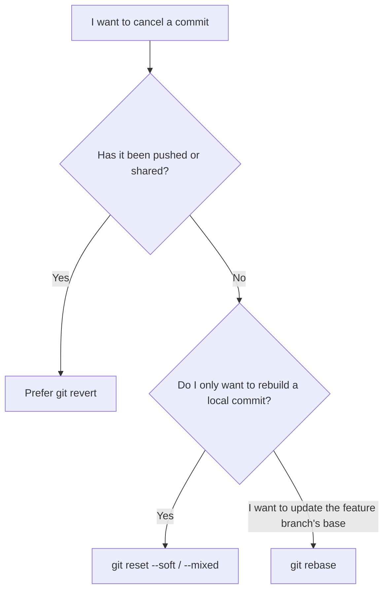

# Module 7: Revert, Reset, and Rebase

These three commands all affect your project history, but they have very different purposes and risks:

| Command | Main purpose | Rewrites existing history? | Beginner rule |
|---|---|---:|---|
| `git revert` | Cancel an old commit with a new commit | No | Prefer it for shared history that has already been pushed |
| `git reset` | Move the current branch pointer | Yes | Use it only for local commits you have not shared |
| `git rebase` | Replay commits on a new base | Yes | Use it only on a branch you control |

:::danger Use a Practice Repository

Do not practice `reset --hard` or rebase for the first time in an important project. The steps below create a local repository that you can safely delete later.

:::

## Step 1: Create a Safe Practice Environment

```bash
cd ~/git-projects
mkdir git-history-lab
cd git-history-lab
git init -b main

echo "line 1" > story.txt
git add story.txt
git commit -m "docs: add line 1"

echo "line 2" >> story.txt
git add story.txt
git commit -m "docs: add line 2"

echo "line 3" >> story.txt
git add story.txt
git commit -m "docs: add line 3"
```

View the three commits:

```bash
git log --oneline --decorate
```

## Revert: Safely Cancel a Change with a New Commit

To cancel the latest commit while keeping the complete history:

```bash
git revert --no-edit HEAD
git log --oneline --decorate
cat story.txt
```

You should see that:

- Git added a new `Revert ...` commit to the history.
- The original commit that added line 3 still exists.
- The latest version of the file no longer contains line 3.

To revert a specific commit, first find its ID with `git log --oneline`:

```bash
git revert <commit-id>
```

If a conflict occurs, resolve it as you would a merge conflict: edit the files, run `git add`, and then continue:

```bash
git revert --continue
```

To cancel the revert instead:

```bash
git revert --abort
```

## Reset: Move a Branch Pointer

Reset is often used to undo local commits that have not been pushed. The three modes decide where the file changes go after Git removes the commit.

| Mode | Commit | Staging area | Working directory |
|---|---|---|---|
| `--soft` | Removed | Changes stay staged | Changes remain |
| `--mixed` | Removed | Changes become unstaged | Changes remain |
| `--hard` | Removed | Changes are discarded | Changes are discarded |

### `--soft`: Rebuild a Commit

First, create a test commit:

```bash
echo "draft" > draft.txt
git add draft.txt
git commit -m "wip"
git reset --soft HEAD~1
git status
```

The change to `draft.txt` is still in the staging area. You can immediately create a better commit:

```bash
git commit -m "docs: add draft"
```

### `--mixed`: Choose What to Stage Again

`--mixed` is the default mode when you do not specify one:

```bash
git reset HEAD~1
git status
```

Git removed the latest commit but kept its changes in the working directory. Those changes are no longer staged, so you can review and add them again:

```bash
git add draft.txt
git commit -m "docs: add reviewed draft"
```

### `--hard`: Discard the Commit and Uncommitted Changes

Create a rescue branch before you practice:

```bash
git branch rescue-before-hard
git reset --hard HEAD~1
git log --oneline --decorate --all
```

`--hard` makes both the staging area and working directory match the target commit. Unsaved changes may become impossible to recover. In this exercise, the rescue branch lets you restore the previous state:

```bash
git reset --hard rescue-before-hard
```

## Reflog: Find Where a Branch Pointed Before

If you lose track of a commit after a reset or branch switch, inspect Git's local reference log:

```bash
git reflog
```

After you find the commit, creating a rescue branch is the safest next step:

```bash
git switch -c recovery <commit-id>
```

The reflog exists only on your computer, and its entries eventually expire. It is a recovery tool, not a backup strategy.

## Rebase: Replay Commits on a New Base

Suppose you started work from an older version of `main`, and `main` later received a new commit. Rebase temporarily removes your feature commits and replays them after the latest `main` commit.


Notice that `F1'` and `F2'` are newly created commits, so their commit IDs are different.

Run rebase from your feature branch:

```bash
git switch feature/my-change
git fetch origin
git rebase origin/main
```

If there are no conflicts, Git moves the feature branch on top of the latest `origin/main`. If a conflict occurs:

```bash
# Edit the conflicted files first
git add <resolved-files>
git rebase --continue
```

Repeat these steps for each conflict. To cancel the entire rebase:

```bash
git rebase --abort
```

## Rebase Safety Rules

- It is usually safe to rebase a feature branch that you have not shared and that only you use.
- Do not casually rebase a shared branch or a branch other people have already pulled.
- If you already pushed the branch, updating it after a rebase may require a force push. Follow your team's rules first.
- When you must update your own remote branch, `--force-with-lease` checks for other people's remote updates and is safer than `--force`. Still confirm that nobody else shares the branch.

```bash
git push --force-with-lease
```

## Which Command Should You Choose?



If you are unsure, stop and save the output of `git status`, `git log --oneline --graph --all`, and `git reflog` before deciding what to do next.

## Official Documentation

- [git revert](https://git-scm.com/docs/git-revert)
- [git reset](https://git-scm.com/docs/git-reset)
- [git rebase](https://git-scm.com/docs/git-rebase)
- [git reflog](https://git-scm.com/docs/git-reflog)
