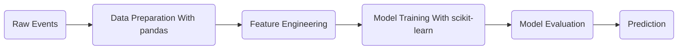

# Machine Learning Overview

Machine Learning is a way to let a computer learn patterns from historical data.

In normal programming, we write rules by ourselves:

```text
if user clicks add_to_cart:
    maybe user wants to buy
```

In machine learning, we prepare examples and let the model learn the pattern:

```text
past user behavior + purchase result -> model learns the pattern
```

For data engineers, the important idea is:

> Machine learning depends on clean, well-organized data.

If the data is messy, duplicated, missing, or designed with the wrong meaning, the model will also be unreliable.

## Python Toolset

For this beginner section, we will use:

- Python
- pandas
- scikit-learn

Install the main packages:

```bash
pip install pandas scikit-learn
```

These tools are enough to learn the basic workflow:

```text
raw data -> pandas DataFrame -> feature table -> scikit-learn model -> evaluation
```

## Example Scenario

We will use an e-commerce behavior example.

The raw data may contain events like:

- `session_start`
- `view_item`
- `add_to_cart`
- `purchase`

The business question is:

> Can we predict whether a user will purchase soon?

This is called a purchase propensity problem.

## Basic Terms

### Row

A row is one training example.

For this example, one row should represent one user.

```text
one user = one row
```

### Feature

A feature is an input column used by the model.

Examples:

- How many sessions did the user have?
- How many products did the user view?
- How many times did the user add items to cart?
- How many days since the user's last activity?

### Label

A label is the answer we want the model to learn.

For this example:

```text
label = did this user purchase?
```

The label can be:

- `1`: yes, the user purchased
- `0`: no, the user did not purchase

### Model

A model is the result of training.

After training, the model can receive new user behavior and output a prediction.

### Prediction

A prediction is the model's guess.

For example:

```text
user_001 -> 0.82 probability of purchase
user_002 -> 0.13 probability of purchase
```

## Machine Learning Workflow



In this basic course, we will focus on:

- Data preparation
- Feature engineering
- Model training
- Model evaluation
- Prediction

## Common Machine Learning Types

### Classification

Classification predicts a category.

Examples:

- Will the user purchase? `yes` or `no`
- Is this transaction fraud? `yes` or `no`
- Is this email spam? `spam` or `not spam`

Our purchase prediction example is a classification problem.

### Regression

Regression predicts a number.

Examples:

- How much revenue will we get tomorrow?
- How long will delivery take?
- What will the house price be?

### Clustering

Clustering groups similar data together.

Examples:

- Group users by behavior
- Group products by buying pattern
- Group articles by topic

## Why Data Engineers Should Learn This

Data engineers do not always train models every day, but they often build the data foundation for machine learning.

Common data engineering responsibilities include:

- Collect raw data from systems
- Clean and transform data
- Build reliable feature tables
- Schedule pipelines
- Monitor data quality
- Deliver data to analysts, data scientists, or ML systems

Machine learning projects often fail because the data pipeline is weak, not because the model algorithm is weak.

<!-- ## Mental Model

Think about machine learning as a data product:

```text
raw events -> training DataFrame -> model -> prediction -> business action
```

Before thinking about advanced algorithms, always ask:

- What are we trying to predict?
- What does one row mean?
- What are the features?
- What is the label?
- Is the label from the future?
- Are the features only from the past?

These questions are more important than choosing a complex model at the beginning. -->
