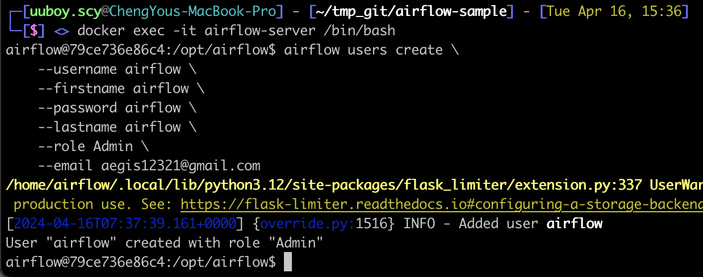

# Airflow 2

[https://airflow.apache.org/docs/docker-stack/index.html](https://airflow.apache.org/docs/docker-stack/index.html)

# Start Airflow standalone with Docker

- Create develop folder
    - Git clone from [https://github.com/uuboyscy/airflow-demo](https://github.com/uuboyscy/airflow-demo)
        ```bash
        git clone --branch v2 --depth 1 https://github.com/uuboyscy/airflow-demo.git
        ```
    
- Start via Docker Container
    - Mac / Linux
        ```bash
        docker run -it -d \
            --name airflow-server \
            -p 8080:8080 \
            -v $PWD/dags:/opt/airflow/dags \
            -v $PWD/logs:/opt/airflow/logs \
            -v $PWD/utils:/opt/airflow/utils \
            -v $PWD/tasks:/opt/airflow/tasks \
            -e PYTHONPATH=/opt/airflow \
            apache/airflow:2.11.0-python3.12 airflow standalone
        ```

    - Windows
        ```powershell
        docker run -it -d `
            --name airflow-server `
            -p 8080:8080 `
            -v "${PWD}/dags:/opt/airflow/dags" `
            -v "${PWD}/logs:/opt/airflow/logs" `
            -v "${PWD}/utils:/opt/airflow/utils" `
            -v "${PWD}/tasks:/opt/airflow/tasks" `
            -e PYTHONPATH=/opt/airflow `
            apache/airflow:2.11.0-python3.12 airflow standalone
        ```
    
- Create user
    
    ```bash
    docker exec -it airflow-server /bin/bash
    
    # Execute following command in container
    airflow users create \
        --username airflow \
        --firstname airflow \
        --password airflow \
        --lastname airflow \
        --role Admin \
        --email your_email@example.com
    
    mkdir -p /opt/airflow/utils
    touch /opt/airflow/utils/__init__.py
    touch /opt/airflow/tasks/__init__.py
    ```
    
    
    

# Quick start

## DAG

d_01_example_dag.py

```python
from datetime import datetime, timedelta

from airflow import DAG
from airflow.operators.python import PythonOperator

def task1():
    print("Running Task 1")

def task2():
    print("Running Task 2")

# Default arguments for the DAG
default_args = {
    'owner': 'airflow',
    'depends_on_past': False,
    'email': ['your_email@example.com'],
    'email_on_failure': False,
    'email_on_retry': False,
    'retries': 1,
    'retry_delay': timedelta(minutes=5),
}

# Define the DAG
dag = DAG(
    'd_01_example_dag',
    default_args=default_args,
    description='An example DAG with Python operators',
    schedule="* * * * *",
    start_date=datetime(2023, 1, 1),
    catchup=False
)

# Define the tasks
task1_obj = PythonOperator(
    task_id='task1',
    python_callable=task1,
    dag=dag,
)

task2_obj = PythonOperator(
    task_id='task2',
    python_callable=task2,
    dag=dag,
)

# Task dependencies
task1_obj >> task2_obj

```

## Operator

```python
task3_obj = BashOperator(
    task_id='task3',
    bash_command='echo "Hello from Task 3!"',
    dag=dag,
)
```

## Dependency

d_02_example_dag_dependency.py

```python
from datetime import datetime, timedelta

from airflow import DAG
from airflow.operators.bash import BashOperator
from airflow.operators.python import PythonOperator

def task1():
    print("Running Task 1")

def task2():
    print("Running Task 2")

# Default arguments for the DAG
default_args = {
    'owner': 'airflow',
    'depends_on_past': False,
    'email': ['your_email@example.com'],
    'email_on_failure': False,
    'email_on_retry': False,
    'retries': 1,
    'retry_delay': timedelta(minutes=5),
}

# Define the DAG
dag = DAG(
    'd_02_example_dag_dependency',
    default_args=default_args,
    description='An example DAG with Python operators',
    schedule="* * * * *",
    start_date=datetime(2023, 1, 1),
    catchup=False
)

# Define the tasks
task1_obj = PythonOperator(
    task_id='task1',
    python_callable=task1,
    dag=dag,
)

task2_obj = PythonOperator(
    task_id='task2',
    python_callable=task2,
    dag=dag,
)

task3_obj = BashOperator(
    task_id='task3',
    bash_command='echo "Hello from Task 3!"',
    dag=dag,
)

# Task dependencies
task1_obj >> task2_obj
task1_obj >> task3_obj

```

## Pass parameters

d_03_example_pass_parameters.py

```python
from datetime import datetime, timedelta

from airflow import DAG
from airflow.operators.python import PythonOperator

def task1():
    print("Running Task 1")
    return "Hello from Task 1!"

def task2(**kwargs):
    ti = kwargs['ti']
    returned_value_from_task1 = ti.xcom_pull(task_ids='task1')
    print("Running Task 2")
    print(f"Received from Task 1: {returned_value_from_task1}")
    

# Default arguments for the DAG
default_args = {
    "owner": "airflow",
    "depends_on_past": False,
    "email": ["your_email@example.com"],
    "email_on_failure": False,
    "email_on_retry": False,
    "retries": 1,
    "retry_delay": timedelta(minutes=5),
}

# Define the DAG
dag = DAG(
    "d_03_example_pass_parameters",
    default_args=default_args,
    description="An example DAG with Python operators",
    schedule_interval="* * * * *",
    start_date=datetime(2023, 1, 1),
    catchup=False
)

# Define the tasks
task1_obj = PythonOperator(
    task_id="task1",
    python_callable=task1,
    dag=dag,
)

task2_obj = PythonOperator(
    task_id="task2",
    python_callable=task2,
    provide_context=True,
    dag=dag,
)

# Task dependencies
task1_obj >> task2_obj

```

## Decorator

d_04_example_dag_decorator.py

```python
import pendulum
from airflow.decorators import dag, task, bash_task

# Define the DAG
@dag(
    schedule="* * * * *",
    start_date=pendulum.datetime(2021, 1, 1, tz="UTC"),
    catchup=False,
    tags=["example"],
)
def d_04_example_dag_decorator():
    @task
    def task1():
        print("Running Task 1")
    @task
    def task2():
        print("Running Task 2")

    @bash_task
    def task3():
        return "echo 'Hello from Task 3!'"

    t1 = task1()
    task2().set_upstream(t1)
    task3().set_upstream(t1)

d_04_example_dag_decorator()

```

d_05_example_pass_parameters_decorator.py

```python
from datetime import datetime, timedelta

from airflow.decorators import dag, task

# Default arguments for the DAG
default_args = {
    "owner": "airflow",
    "depends_on_past": False,
    "email": ["your_email@example.com"],
    "email_on_failure": False,
    "email_on_retry": False,
    "retries": 1,
    "retry_delay": timedelta(minutes=5),
}

@dag(
    dag_id="d_05_example_pass_parameters_decorator",
    default_args=default_args,
    description="An example DAG with Python operators",
    schedule_interval="* * * * *",
    start_date=datetime(2023, 1, 1),
    catchup=False,
    tags=["example", "decorator"]  # Optional: Add tags for better filtering in the UI
)
def d_05_example_pass_parameters_decorator():
    @task
    def task1():
        print("Running Task 1")
        return "Hello from Task 1!"

    @task
    def task2(returned_value_from_task1):
        print("Running Task 2")
        print(f"Received from Task 1: {returned_value_from_task1}")

    # Task dependencies defined by calling the tasks in sequence
    result_from_task1 = task1()
    task2(result_from_task1)

# Instantiate the DAG
d_05_example_pass_parameters_decorator()

```

d_06_example_pass_parameters_cli.py

```python
"""
CLI command:
airflow dags trigger -c '{"start_date": "2024-01-01", "end_date": "2024-03-01"}' d_06_example_pass_parameters_cli
airflow dags test -c '{"start_date": "2024-01-01", "end_date": "2024-03-01"}' d_06_example_pass_parameters_cli
"""
from datetime import datetime

from airflow.decorators import dag, task

# Default values for start_date and end_date
DEFAULT_START_DATE = "2023-01-01"
DEFAULT_END_DATE = "2023-12-31"

@dag(
    dag_id="d_06_example_pass_parameters_cli",
    schedule_interval=None,  # Set to None for manual triggering
    start_date=datetime(2023, 1, 1),
    catchup=False,
    tags=["example", "cli_variables_defaults"]
)
def d_06_example_pass_parameters_cli():
    @task
    def extract_parameters(ti):
        config = ti.xcom_pull(task_ids='trigger', key='return_value') or {}
        # Get parameters with defaults if not provided via CLI
        start_date = config.get('start_date', DEFAULT_START_DATE)
        end_date = config.get('end_date', DEFAULT_END_DATE)
        return {"start_date": start_date, "end_date": end_date}

    @task
    def start_task(date_params):
        # This task can use the start_date and end_date directly
        print(f"Task runs with a start date of {date_params.get('start_date')} and end date of {date_params.get('end_date')}")

    date_params = extract_parameters()
    start_task(date_params)

# Create the DAG instance
d_06_example_pass_parameters_cli()

```

## Data Pipeline

d_07_example_data_pipeline.py

```python
from datetime import datetime, timedelta

import pandas as pd
from airflow.decorators import dag, task

# Default arguments for the DAG
default_args = {
    "owner": "airflow",
    "depends_on_past": False,
    "email": ["your_email@example.com"],
    "email_on_failure": False,
    "email_on_retry": False,
    "retries": 1,
    "retry_delay": timedelta(minutes=5),
}

@dag(
    dag_id="d_07_example_data_pipeline",
    default_args=default_args,
    description="An example DAG with Python operators",
    schedule_interval="* * * * *",
    start_date=datetime(2023, 1, 1),
    catchup=False,
    tags=["example", "decorator"]  # Optional: Add tags for better filtering in the UI
)
def d_07_example_data_pipeline():
    @task
    def e_data_source_1() -> pd.DataFrame:
        print("Getting df1.")
        return pd.DataFrame(data=[[1], [2]], columns=["col"])

    @task
    def e_data_source_2() -> pd.DataFrame:
        print("Getting df2.")
        return pd.DataFrame(data=[[3], [4]], columns=["col"])

    @task
    def t_concat(df1: pd.DataFrame, df2: pd.DataFrame) -> pd.DataFrame:
        print("Concating df1 and df2.")
        return pd.concat([df1, df2]).reset_index(drop=True)
    
    @task
    def l_db1(df: pd.DataFrame) -> None:
        print("Loading df to db1.")
        print(df)
        print("===============")

    @task
    def l_db2(df: pd.DataFrame) -> None:
        print("Loading df to db2.")
        print(df)
        print("===============")

    # Task dependencies defined by calling the tasks in sequence
    df1 = e_data_source_1()
    df2 = e_data_source_2()
    df = t_concat(df1, df2)
    l_db1(df)
    l_db2(df)

# Instantiate the DAG
d_07_example_data_pipeline()

```

# Notification

[https://airflow.apache.org/docs/apache-airflow/2.6.0/howto/notifications.html](https://airflow.apache.org/docs/apache-airflow/2.6.0/howto/notifications.html)

## Try import from utils

utils/testutils.py

```python
def testfunc():
    print("===========")
    print("test")
    print("===========")

```

d_08_example_import_utils.py

```python
from datetime import datetime, timedelta

from airflow.decorators import dag, task

from utils.testutils import testfunc

# Default arguments for the DAG
default_args = {
    "owner": "airflow",
    "depends_on_past": False,
    "email": ["your_email@example.com"],
    "email_on_failure": False,
    "email_on_retry": False,
    "retries": 1,
    "retry_delay": timedelta(minutes=5),
}

@dag(
    dag_id="d_08_example_import_utils",
    default_args=default_args,
    description="An example DAG with Python operators",
    schedule_interval="* * * * *",
    start_date=datetime(2023, 1, 1),
    catchup=False,
    tags=["example", "decorator"]  # Optional: Add tags for better filtering in the UI
)
def d_08_example_import_utils():
    @task
    def call_custom_utils() -> None:
        testfunc()

    # Task dependencies defined by calling the tasks in sequence
    call_custom_utils()

# Instantiate the DAG
d_08_example_import_utils()

```

## Implement

utils/my_notifier.py

```
import time

from airflow.notifications.basenotifier import BaseNotifier

def send_message(title, message) -> None:
    print(title)
    print(message)
    print("Message sent.")
    with open(f"/tmp/test_notification_message_{time.time_ns()}.txt", "w") as f:
        f.write(f"{title}\n=====\n{message}\n")

class MyNotifier(BaseNotifier):
    template_fields = ("message",)

    def __init__(self, message):
        self.message = message

    def notify(self, context):
        # Send notification here, below is an example
        title = f"Task {context['task_instance'].task_id} failed"
        send_message(title, self.message)

```

## Apply

d_09_example_notification.py

```python
import random
from datetime import datetime, timedelta

from airflow.decorators import dag, task

from utils.my_notifier import MyNotifier

default_args = {
    "owner": "airflow",
    "depends_on_past": False,
    "email": ["your_email@example.com"],
    "email_on_failure": False,
    "email_on_retry": False,
    "retries": 1,
    "retry_delay": timedelta(minutes=5),
}

@dag(
    dag_id="d_09_example_notification",
    default_args=default_args,
    description="An example DAG with Python operators",
    schedule_interval="* * * * *",
    start_date=datetime(2023, 1, 1),
    on_success_callback=MyNotifier(message="Success!"),
    on_failure_callback=MyNotifier(message="Failure!"),
    catchup=False,
    tags=["example", "decorator"]  # Optional: Add tags for better filtering in the UI
)
def d_09_example_notification():
    @task
    def success_or_failure() -> None:
        if random.randint(0,1) == 0:
            print("Failure!")
            raise
        else:
            print("Success!")

    success_or_failure()

# Instantiate the DAG
d_09_example_notification()
```

# Manage tasks

## Import tasks

tasks/test_tasks.py

```python
from airflow.decorators import task

@task
def do_something(some_str: str) -> list[str]:
    return list(some_str)

```

d_10_example_import_tasks.py

```python
import random
from datetime import datetime, timedelta

from airflow.decorators import dag, task

from tasks.test_tasks import do_something

default_args = {
    "owner": "airflow",
    "depends_on_past": False,
    "email": ["your_email@example.com"],
    "email_on_failure": False,
    "email_on_retry": False,
    "retries": 1,
    "retry_delay": timedelta(minutes=5),
}

@dag(
    dag_id="d_10_example_import_tasks",
    default_args=default_args,
    description="An example DAG with Python operators",
    schedule_interval="* * * * *",
    start_date=datetime(2023, 1, 1),
    catchup=False,
)
def d_10_example_import_tasks():
    @task
    def generate_some_str() -> str:
        return "HELLO"

    @task
    def print_something(something: str | list) -> None:
        print("======")
        print(something)
        print("======")

    some_str = generate_some_str()
    result = do_something(some_str)
    print_something(result)

# Instantiate the DAG
d_10_example_import_tasks()
```

## TaskGroup

d_11_example_import_taskgroup.py

```python
from datetime import datetime, timedelta

from airflow.decorators import dag, task
from airflow.utils.task_group import TaskGroup

from tasks.test_tasks import do_something

default_args = {
    "owner": "airflow",
    "depends_on_past": False,
    "email": ["your_email@example.com"],
    "email_on_failure": False,
    "email_on_retry": False,
    "retries": 1,
    "retry_delay": timedelta(minutes=5),
}

@dag(
    dag_id="d_11_example_import_taskgroup",
    default_args=default_args,
    description="An example DAG with Python operators",
    schedule_interval="* * * * *",
    start_date=datetime(2023, 1, 1),
    catchup=False,
)
def d_11_example_import_taskgroup():
    @task
    def generate_some_str() -> str:
        return "HELLO"

    @task
    def print_something_separately(something: str | list) -> None:
        print("======")
        print(something)
        print("======")

    some_str = generate_some_str()
    result = do_something(some_str)
    with TaskGroup(group_id='do_something_task_group') as do_something_task_group:
        # Dynamically create task instances for processing
        print_something_separately.expand(something=result)

# Instantiate the DAG
d_11_example_import_taskgroup()

```