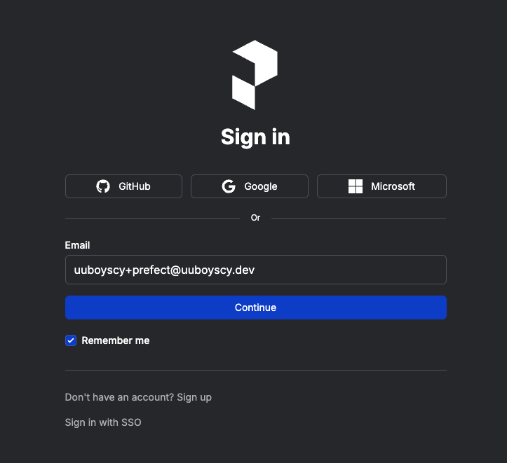

# Prefect

# Quick start

## Register

[https://www.prefect.io](https://www.prefect.io/)




## Get token


## Develop environment

[https://github.com/uuboyscy/prefect-demo](https://github.com/uuboyscy/prefect-demo)

```bash
prefect cloud login \
	--key <your token> \
	--workspace <your workspace>
```


# Flow and task

f_01_quick_start.py

```python
import pandas as pd
from prefect import flow, task

@task
def e_data_source_1() -> pd.DataFrame:
    print("Getting df1.")
    return pd.DataFrame(data=[[1], [2]], columns=["col"])

@task
def e_data_source_2() -> pd.DataFrame:
    print("Getting df2.")
    return pd.DataFrame(data=[[3], [4]], columns=["col"])

@task
def t_concat(df1: pd.DataFrame, df2: pd.DataFrame) -> pd.DataFrame:
    print("Concating df1 and df2.")
    return pd.concat([df1, df2]).reset_index(drop=True)

@task
def l_db1(df: pd.DataFrame) -> None:
    print("Loading df to db1.")
    print(df)
    print("===============")

@task
def l_db2(df: pd.DataFrame) -> None:
    print("Loading df to db2.")
    print(df)
    print("===============")

@flow(name="f_01_quick_start")
def f_01_quick_start() -> None:
    df1 = e_data_source_1()
    df2 = e_data_source_2()
    df = t_concat(df1, df2)
    l_db1(df)
    l_db2(df)

if __name__ == "__main__":
    f_01_quick_start()

```


f_02_async_task

```python
import pandas as pd
from prefect import flow, task

@task
def e_data_source_1() -> pd.DataFrame:
    print("Getting df1.")
    return pd.DataFrame(data=[[1], [2]], columns=["col"])

@task
def e_data_source_2() -> pd.DataFrame:
    print("Getting df2.")
    return pd.DataFrame(data=[[3], [4]], columns=["col"])

@task
def t_concat(df1: pd.DataFrame, df2: pd.DataFrame) -> pd.DataFrame:
    print("Concating df1 and df2.")
    return pd.concat([df1, df2]).reset_index(drop=True)

@task
def l_db1(df: pd.DataFrame) -> None:
    print("Loading df to db1.")
    print(df)
    print("===============")

@task
def l_db2(df: pd.DataFrame) -> None:
    print("Loading df to db2.")
    print(df)
    print("===============")

@flow(name="f_02_async_task")
def f_02_async_task() -> None:
    df1 = e_data_source_1.submit()
    df2 = e_data_source_2.submit()
    df = t_concat.submit(
        df1, df2, wait_for=[df1, df2],
    )
    l_db1.submit(df, wait_for=[df])
    l_db2.submit(df, wait_for=[df])

if __name__ == "__main__":
    f_02_async_task()

```


# Register flow

## Work pool and queue

Add work Pool `test` and Queue `docker-deployment`


Select Prefect Agent


Prefect login locally

```bash
prefect profile create demo
prefect profile use demo
prefect cloud login \
	-k pnu_nS3ZKp8OHSbkK5bAbWKxLZEKHz5fVg36sod1 \
	--workspace tir101/default
```

## Agent

Run Agent on pool `test` and create a queue `docker-deplyment`

```bash
prefect agent start --pool "test" --work-queue "docker-deplymet"
```

## Runner

```bash
docker build -t ghcr.io/uuboyscy/prefect-demo/prefect-demo-image .
```

## Block


## Register

```bash
prefect deployment build \
	src/flow/f_01_quick_start.py:f_01_quick_start \
	-n docker \
	-p test \
	-q docker-deplymet \
  -sb "github/github-prefect-demo" \
  -ib "docker-container/demo-docker-container" \
  -a
```

```bash
prefect deployment build \
	src/flow/f_01_quick_start.py:f_01_quick_start \
	-n docker-local \
	-p test \
	-q docker-local \
  -sb "github/github-prefect-demo" \
  -a
```

# Schedule

Setup on web GUI


# Prefect cloud status

[https://prefect.status.io](https://prefect.status.io/)