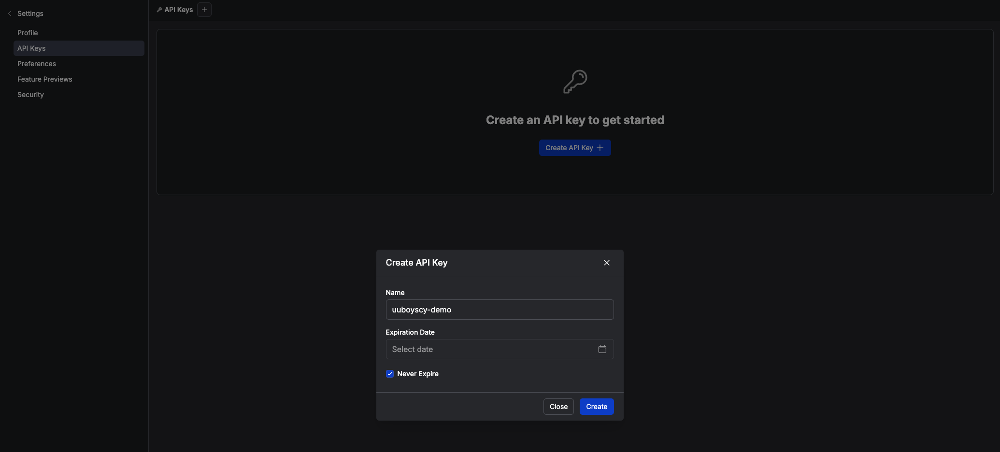

# Prefect

# Demo Repository
https://github.com/uuboyscy/prefect-demo

# Quick start

## Register

[https://www.prefect.io](https://www.prefect.io/)


Login with OTP


## Get token

- Click `API keys`\


- Click `Create API key`


- Determine API key information


- Login with token


## Develop environment

Clone this repository for development\
[https://github.com/uuboyscy/prefect-demo](https://github.com/uuboyscy/prefect-demo)

Login
```bash
prefect cloud login --k <your token> 
```


## Get Start for Your First Flow
Go back to home page and click `Get started`


You will find the authentication turn green.\
Press `Next` and follow the steps, then you can create the first flow.

# Flow and task

f_01_quick_start.py

```python
import pandas as pd
from prefect import flow, task

@task
def e_data_source_1() -> pd.DataFrame:
    print("Getting df1.")
    return pd.DataFrame(data=[[1], [2]], columns=["col"])

@task
def e_data_source_2() -> pd.DataFrame:
    print("Getting df2.")
    return pd.DataFrame(data=[[3], [4]], columns=["col"])

@task
def t_concat(df1: pd.DataFrame, df2: pd.DataFrame) -> pd.DataFrame:
    print("Concating df1 and df2.")
    return pd.concat([df1, df2]).reset_index(drop=True)

@task
def l_db1(df: pd.DataFrame) -> None:
    print("Loading df to db1.")
    print(df)
    print("===============")

@task
def l_db2(df: pd.DataFrame) -> None:
    print("Loading df to db2.")
    print(df)
    print("===============")

@flow(name="f_01_quick_start")
def f_01_quick_start() -> None:
    df1 = e_data_source_1()
    df2 = e_data_source_2()
    df = t_concat(df1, df2)
    l_db1(df)
    l_db2(df)

if __name__ == "__main__":
    f_01_quick_start()

```


f_02_async_task

```python
import pandas as pd
from prefect import flow, task

@task
def e_data_source_1() -> pd.DataFrame:
    print("Getting df1.")
    return pd.DataFrame(data=[[1], [2]], columns=["col"])

@task
def e_data_source_2() -> pd.DataFrame:
    print("Getting df2.")
    return pd.DataFrame(data=[[3], [4]], columns=["col"])

@task
def t_concat(df1: pd.DataFrame, df2: pd.DataFrame) -> pd.DataFrame:
    print("Concating df1 and df2.")
    return pd.concat([df1, df2]).reset_index(drop=True)

@task
def l_db1(df: pd.DataFrame) -> None:
    print("Loading df to db1.")
    print(df)
    print("===============")

@task
def l_db2(df: pd.DataFrame) -> None:
    print("Loading df to db2.")
    print(df)
    print("===============")

@flow(name="f_02_async_task")
def f_02_async_task() -> None:
    df1 = e_data_source_1.submit()
    df2 = e_data_source_2.submit()
    df = t_concat.submit(
        df1, df2, wait_for=[df1, df2],
    )
    l_db1.submit(df, wait_for=[df])
    l_db2.submit(df, wait_for=[df])

if __name__ == "__main__":
    f_02_async_task()

```


# Register flow

## Work pool and worker

- Create a work Pool `test` and Queue `docker-deployment`
    

- Select Process Worker
    

- Name the Worker `test-process` and then create it
    

- Start a Worker
    
    ```bash
    prefect worker start --pool "test-process"
    ```

## Block

- Create a GitHub Repository Block
    
    


## Build Deployment
```python
from flows.test.hello_world_flow import hello_world_flow


if __name__ == "__main__":
    from prefect_github import GitHubRepository

    hello_world_flow.from_source(
        source=GitHubRepository.load("github-repository-uuboyscy"),
        entrypoint="src/flow/test/hello_world_flow_flow.py:hello_world_flow",
    ).deploy(
        name="test-deploy",
        tags=["test", "project_1"],
        work_pool_name="test-subproc",
        cron="1 * * * *"
    )

```


# Schedule

- Setup on web GUI
    

# Prefect cloud status

[https://prefect.status.io](https://prefect.status.io/)