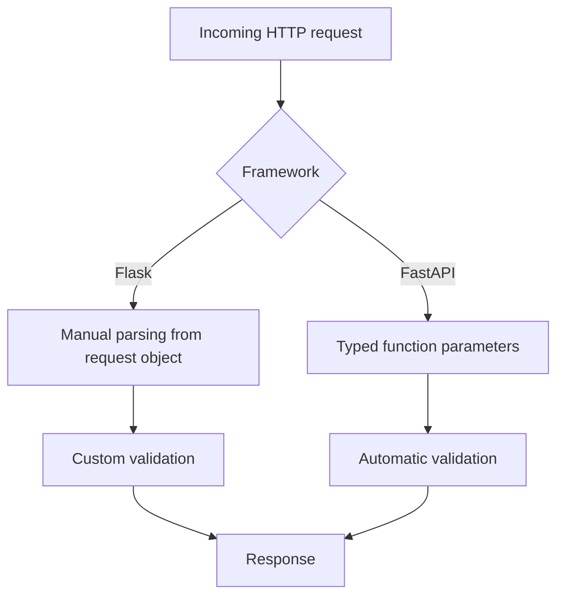

# Handle Requests and Responses in FastAPI

This page shows common request patterns in FastAPI. The examples mirror the Flask flow in this project, so you can compare both frameworks side by side.

## Capture path parameters

FastAPI maps path parameters directly to function arguments.

```python
from fastapi import FastAPI

app = FastAPI()


@app.get("/hello_fastapi/{username}")
def hello_user(username: str):
    return {"message": f"Hello {username}!"}


@app.get("/hello_fastapi/{username}/{age}")
def user_info(username: str, age: int):
    return {"message": f"Hello {username}, you are {age} years old!"}
```

- **`username: str`**: FastAPI treats it as text input.
- **`age: int`**: FastAPI validates this as an integer. If invalid, it returns a 422 error.

## Read query string parameters

Use normal function parameters for query strings.

```python
from typing import Optional
from fastapi import FastAPI

app = FastAPI()


@app.get("/hello_get")
def hello_get(username: Optional[str] = None, userage: Optional[int] = None):
    if username is None:
        return {"message": "Who are you?"}

    if userage is None:
        return {"message": f"Hello {username}!"}

    return {"message": f"Hello {username}! You are {userage} years old."}
```

- **Optional params**: Set defaults like `None`.
- **Auto conversion**: FastAPI converts `userage` to `int` when possible.

## Accept form submissions

For HTML form posts, use `Form`.

```python
from fastapi import FastAPI, Form
from fastapi.responses import HTMLResponse

app = FastAPI()


@app.get("/hello_post", response_class=HTMLResponse)
def hello_post_form():
    return """
    <html>
      <form action="/hello_post" method="POST">
        <label>What is your name?</label><br>
        <input type="text" name="username" />
        <button type="submit">Submit</button>
      </form>
    </html>
    """


@app.post("/hello_post", response_class=HTMLResponse)
def hello_post(username: str = Form(...)):
    return f"""
    <html>
      <p>Hello {username}</p>
      <a href="/hello_post">Back</a>
    </html>
    """
```

Install `python-multipart` if you use form fields:

```bash
pip install python-multipart
```

## Compare Flask vs FastAPI for request handling

- **Flask**: You manually read from `request.args` / `request.form`.
- **FastAPI**: Parameters are declared in the function signature with type hints.
- **FastAPI advantage**: Better validation and auto-generated docs with less boilerplate.


