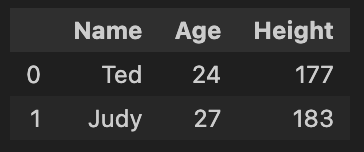

# DataFrame

# DataFrame

- Pandas 中的一種資料結構
- 二維結構，也就是表格
- 包含 index 和 column

# Example

[https://github.com/uuboyscy/course-datamining/blob/master/module_05_Pandas_introduction/00_pandas.ipynb](https://github.com/uuboyscy/course-datamining/blob/master/module_05_Pandas_introduction/00_pandas.ipynb)

## Create DataFrame

## Insert data

## Add a column

## Drop a column

## Drop a row

## Modify data

## Create DataFrame with data

## Concat DataFrame

## Reset index

