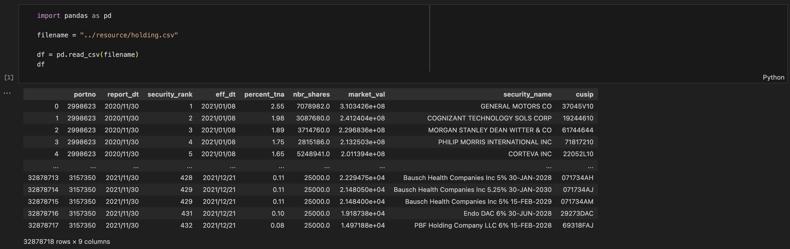

# Category

# Load DataFrame

# groupby()

`SELECT portno, COUNT(1) FROM table GROUP BY portno`

`SELECT portno, SUM(security_rank), … FROM table GROUP BY portno`

`SELECT portno, SUM(nbr_shares) FROM table GROUP BY portno`

# sort_values()

