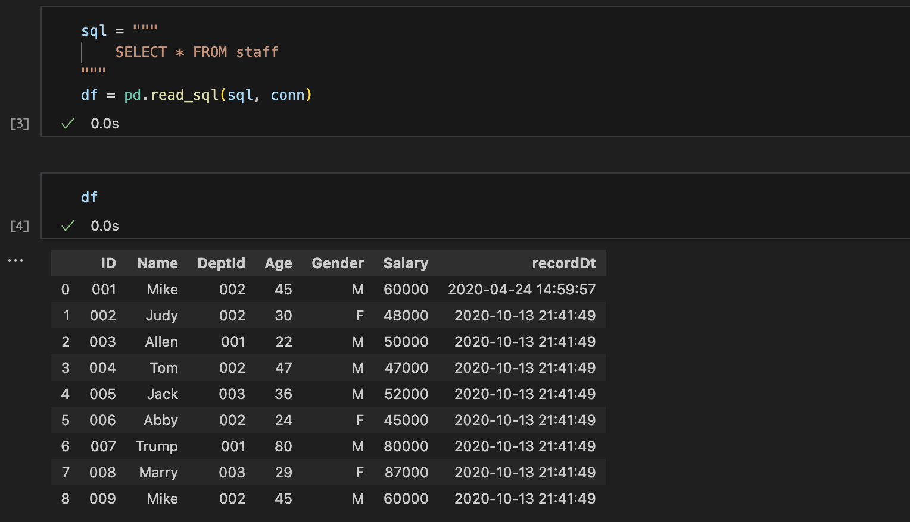

# read_sql

# Create connection

```python
from urllib.parse import quote_plus

import pandas as pd
from sqlalchemy import create_engine

username = quote_plus("root")
password = quote_plus("your_password")
server = "127.0.0.1:3306"
db_name = "testdb"

conn = create_engine(
    f"mysql+pymysql://{username}:{password}@{server}/{db_name}",
).connect()
```

# Load DataFrame via SQL

