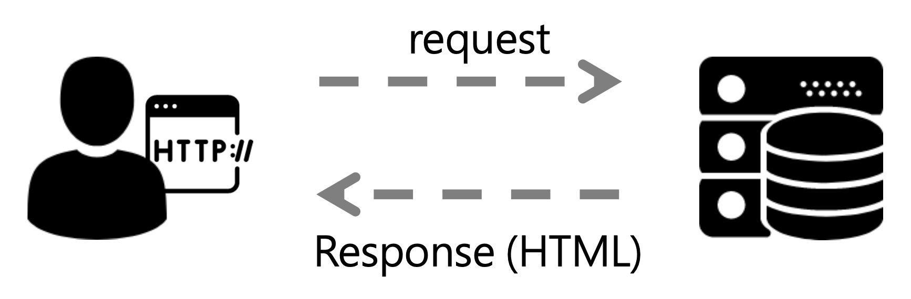
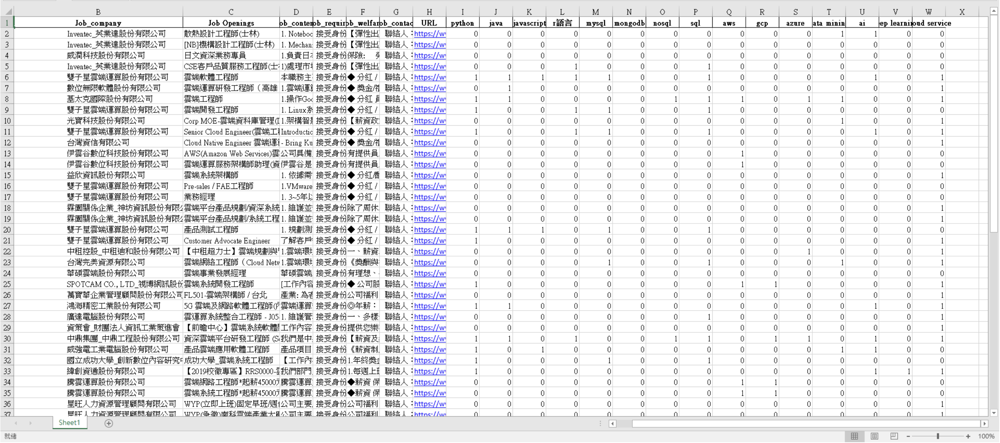

# Web Crawler Intro

## What is a Web Crawler?

A **Web Crawler** is a script or program that automatically navigates websites and **extracts** or **uploads** data according to predefined rules. It simulates browser behavior to perform actions like clicking links, downloading articles, or extracting specific information from web pages.

Crawlers help automate **repetitive** web tasks and are widely used in data engineering and analysis.

---

## Why Use a Web Crawler?

The internet contains vast amounts of data that's hard to collect manually. Web crawlers are essential for:

- Search engine indexing (e.g., Google)
- Collecting article lists from news websites
- Gathering job listings from 104
- Price comparison across e-commerce sites
- Investment data analysis

They are especially useful when extracting **large volumes of similarly structured web pages**.

---

## How It Works: Simulating Browser Behavior

When you visit a website using a browser, it sends an **HTTP request** to a remote server, which returns the **HTML source code**. A crawler mimics this process:

1. Sends an HTTP request (e.g., GET)
2. Receives a response (HTML/JSON/XML)
3. Parses the data structure
4. Extracts, cleans, and stores the necessary information

---

## Static vs Dynamic Pages

| Type            | Characteristics                              | Handling Method                                 |
|-----------------|-----------------------------------------------|-------------------------------------------------|
| **Static Page** | Data is directly embedded in HTML source     | Use `requests` + `BeautifulSoup`                |
| **Dynamic Page**| Data is generated by JavaScript on the page  | Use `selenium` to simulate browser |

---

## Common Tools and Libraries

| Tool / Library     | Purpose                                      |
|--------------------|----------------------------------------------|
| `requests`         | Sends HTTP requests                          |
| `BeautifulSoup`    | Parses HTML content                         |
| `lxml` / `html.parser` | Parsing engines for HTML                  |
| `selenium`         | Simulates browser interaction for dynamic pages |
| `pandas`           | Organizes and stores structured data        |
| `re` (Regex)       | Text processing and pattern extraction      |

---

## Example
