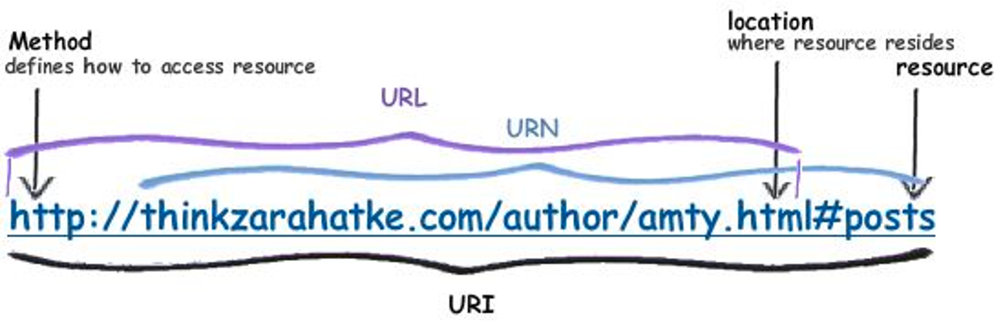

# Key Words

- Headers
- Cookies
- Payload
    - Query string parameters (url?arg1=123&arg2=456)
    - form data (POST from form)
    - [https://www.google.com](https://www.google.com/)
- URL
    
- HTTP Methods
  - GET
  - POST
- Developer Tools
  - Element
  - Network
