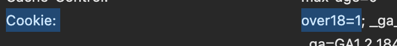
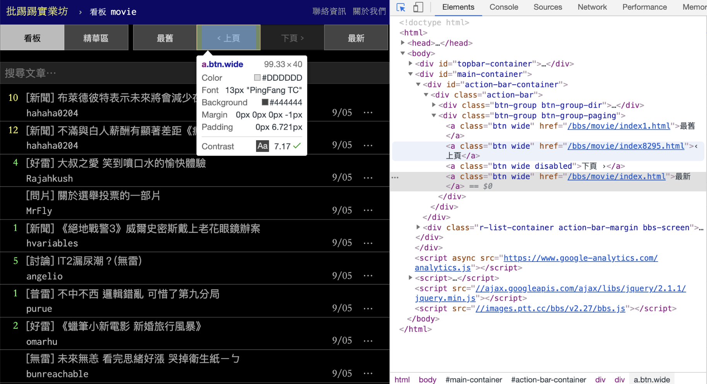
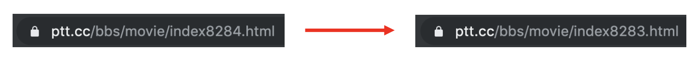

# Web Crawler for Static Web Page

## What to Do

For this example, we'll create a web crawler to scrape articles from PTT's Gossiping board. Here are the key steps:

1. **Prepare Headers and Cookies**
   - 
   - 
    ```python
    headers = {
        'User-Agent': 'Mozilla/5.0 (Windows NT 10.0; Win64; x64) AppleWebKit/537.36 (KHTML, like Gecko) Chrome/119.0.0.0 Safari/537.36'
    }
    cookies = {
        'over18': '1'
    }
    ```

2. **Use BeautifulSoup to Parse HTML Content**
   - Article titles
   - Authors
   - Dates
   - Links

3. Crawl Multiple Page and Save Data

## Implementation

### Install requests and BeatifulSoup

To install the required libraries, follow these steps:

1. Open your terminal or command prompt
2. Run the following command to install requests:
   ```bash
   pip install requests bs4
   ```
   - Or you can use other package management tools:
     - Using Poetry
        ```bash
        poetry add requests bs4
        ```

     - Using Pipenv 
        ```bash
        pipenv install requests bs4
        ```
3. Verify the installation:
   ```bash
   python -c "import requests; print(requests.__version__)"
   ```

The requests library will be used to send HTTP requests and handle responses from web servers.

### Usage of requests and BeautifulSoup

The main libraries used are:

- `requests`: Handles HTTP requests and responses
  - Sends GET/POST requests
  - Manages headers and cookies
  - Handles response status codes

- `BeautifulSoup`: Parses HTML content
  - Extracts data using selectors
  - Navigates HTML structure
  - Cleans and formats text

### Basic Usage
- requests functions
  -  `requests.get(url, headers=None, cookies=None)`
    - Sends a GET request to the specified URL
  - `requests.post(url, data=None, json=None)`
    - Sends a POST request with form data or JSON
- BeautifulSoup functions
  - `BeautifulSoup(html, "html.parser")`
    - Creates a BeautifulSoup object to parse HTML
    - → Use it to process the HTML content returned from requests.get()
  - `soup.select(css_selector)`
    - Finds all elements matching a CSS selector
    - → Returns a list of tag (even if it has one result)
  - `soup.find_all(tag, attrs={})`
    - Finds all elements matching the tag and attributes
    - → Returns a list of tag (even if it has one result)

### Crawl Article titles and Other Information
```python
from bs4 import BeautifulSoup
import requests

url = "https://www.ptt.cc/bbs/Gossiping/index.html"
res = requests.get(url, headers=headers, cookies=cookies)
soup = BeautifulSoup(res.text, "html.parser")

articles = soup.select("div.r-ent")

for article in articles:
    title_tag = article.select_one("div.title a")
    author = article.select_one("div.meta div.author")
    date = article.select_one("div.meta div.date")
    
    if title_tag:
        print("Title:", title_tag.text)
        print("Link:", "https://www.ptt.cc" + title_tag["href"])
        print("Author:", author.text if author else "N/A")
        print("Date:", date.text if date else "N/A")
        print("-" * 40)
```

### Crawl Multiple Page and Save Data
- Find link
  
- Find URL pattern
  
