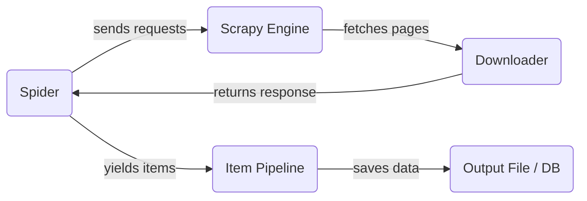

# Scrapy Guide

Scrapy is a Python framework for building web crawlers. Unlike `requests` + `BeautifulSoup`, Scrapy handles everything — sending requests, parsing HTML, following links, and saving data — all in one structured project.

Use Scrapy when your crawler needs to:
- Handle many pages or multiple URLs
- Follow links automatically
- Save data to files or databases in a consistent way

---

## How Scrapy Works



The **Spider** defines what to crawl and how to parse it. The **Engine** handles scheduling and data flow. The **Pipeline** processes and saves the scraped data.

---

## Installation

```bash
pip install scrapy
```

Verify the installation:

```bash
scrapy version
```

---

## Create a Scrapy Project

```bash
scrapy startproject my_crawler
cd my_crawler
```

### Project Structure

```
my_crawler/
├── scrapy.cfg
└── my_crawler/
    ├── __init__.py
    ├── items.py        # Define data structure
    ├── middlewares.py  # Custom request/response hooks
    ├── pipelines.py    # Process and save scraped data
    ├── settings.py     # Project configuration
    └── spiders/        # Put your spiders here
        └── __init__.py
```

The most important files for beginners are:

- **`spiders/`**: Where you write your crawling logic
- **`items.py`**: Define the fields you want to collect
- **`pipelines.py`**: Process the collected data (e.g., save to CSV, database)
- **`settings.py`**: Control crawl speed, headers, pipelines, etc.

---

## Create Your First Spider

Create a file inside `spiders/` — for example, `spiders/quotes_spider.py`:

```python
import scrapy

class QuotesSpider(scrapy.Spider):
    name = "quotes"  # Unique name for this spider
    start_urls = [
        "https://quotes.toscrape.com/",
    ]

    def parse(self, response):
        for quote in response.css("div.quote"):
            yield {
                "text": quote.css("span.text::text").get(),
                "author": quote.css("small.author::text").get(),
            }

        # Follow the "next" page link
        next_page = response.css("li.next a::attr(href)").get()
        if next_page:
            yield response.follow(next_page, self.parse)
```

Key parts of a spider:

- **`name`**: Used to run the spider from the terminal
- **`start_urls`**: The pages Scrapy will crawl first
- **`parse()`**: Called for each response — extract data and follow links here

---

## CSS Selectors in Scrapy

Scrapy uses CSS selectors (similar to BeautifulSoup) to extract data from HTML.

| Method | Description |
|---|---|
| `response.css("tag::text").get()` | Get text from the first matching element |
| `response.css("tag::text").getall()` | Get text from all matching elements |
| `response.css("tag::attr(href)").get()` | Get an attribute value |
| `response.css("tag")` | Select elements (returns a list) |

### Example

```python
# HTML: <a href="/page/2" class="next">Next</a>
response.css("a.next::attr(href)").get()   # → "/page/2"
response.css("a.next::text").get()          # → "Next"
```

---

## Run the Spider

```bash
scrapy crawl quotes
```

### Save Output to a File

```bash
# Save as JSON
scrapy crawl quotes -o output.json

# Save as CSV
scrapy crawl quotes -o output.csv
```

---

## Use Scrapy Shell to Debug

Before writing your spider, use the Scrapy shell to test your selectors interactively.

```bash
scrapy shell "https://quotes.toscrape.com/"
```

Inside the shell:

```python
# Test selectors
response.css("div.quote span.text::text").getall()
response.css("small.author::text").getall()
```

This saves a lot of time — you can confirm the selector works before putting it in your spider.

---

## Custom Headers and Settings

Edit `settings.py` to configure the crawler:

```python
# Slow down requests to be polite
DOWNLOAD_DELAY = 1  # seconds between requests

# Set a custom User-Agent
USER_AGENT = "Mozilla/5.0 (compatible; MyBot/1.0)"
```

For pipeline configuration, see [Scrapy Pipeline](10_Scrapy%20Pipeline.md).

---

## Define Items (Optional but Recommended)

Using `items.py` makes your data structure explicit and easier to reuse.

```python
# items.py
import scrapy

class QuoteItem(scrapy.Item):
    text = scrapy.Field()
    author = scrapy.Field()
```

In your spider, yield the item instead of a plain dict:

```python
from my_crawler.items import QuoteItem

def parse(self, response):
    for quote in response.css("div.quote"):
        item = QuoteItem()
        item["text"] = quote.css("span.text::text").get()
        item["author"] = quote.css("small.author::text").get()
        yield item
```

---

## Scrapy vs requests + BeautifulSoup

| Feature | requests + BS4 | Scrapy |
|---|---|---|
| Setup | Simple | Requires project structure |
| Multi-page crawling | Manual loop | Built-in with `follow()` |
| Concurrency | No (sequential) | Yes (async by default) |
| Data pipeline | Manual | Built-in pipeline |
| Best for | Small, one-off scripts | Large or recurring crawlers |

Use `requests` + `BeautifulSoup` for quick scripts. Use Scrapy when you need something more structured and scalable.
