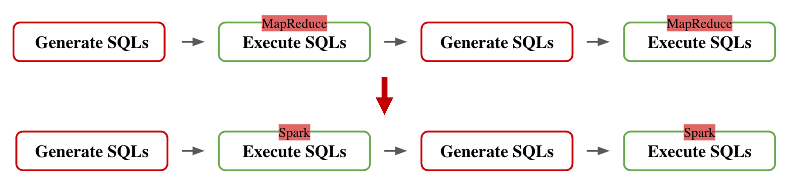
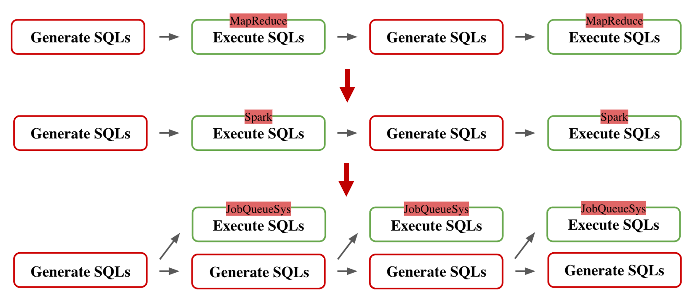
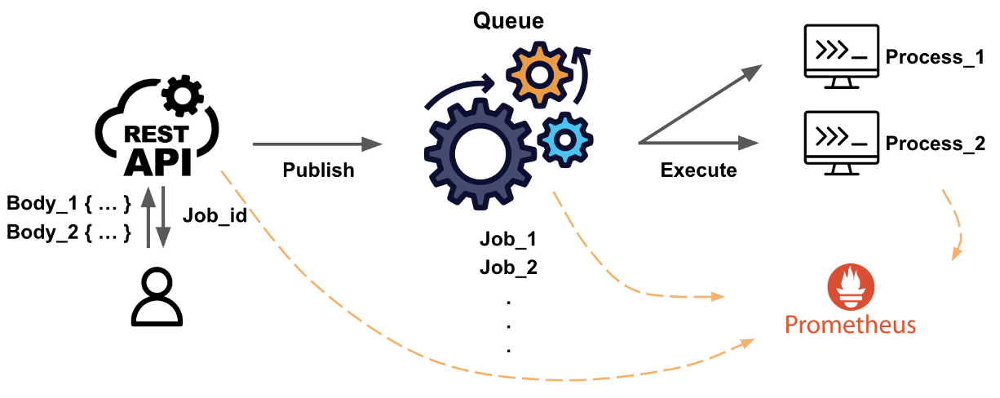
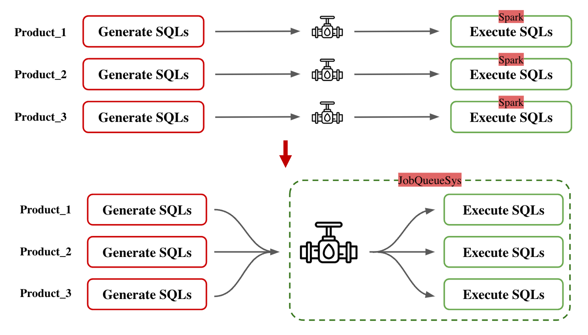
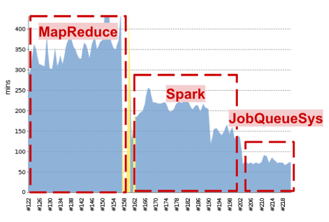

# From MapReduce to Spark: The Evolution of Big Data Processing

## 1. Introduction: Big Data Challenges

Big data means working with very large amounts of information. In one of my jobs, I had to handle 500TB of data and run more than 10,000 SQL queries every day. The old system we used was slow and had many problems, like some tasks taking over 24 hours to finish. In this blog, I will share how I solved these problems by using Spark and making the system faster and better.

<!-- truncate -->

---

## 2. What is Hadoop Hive and MapReduce?

Hadoop Hive is a tool that helps process big data using SQL queries. It works with a system called MapReduce, which was great when it was created but has many limits now:

- **Processes One Query at a Time**: It could not run many queries at once.
- **Very Slow**: Large or complicated tasks took a long time.
- **Not Efficient**: It used too many resources for simple tasks.

In my work, these issues caused delays, and some tasks took more than one day to finish.

---

## 3. Problems with the Old System

The old system was not good enough for our needs:

- **One Query per Task**: Each SQL query was treated as a separate job, wasting resources.
- **Huge Data Size**: Processing 100TB of data made it even harder.
- **Long Task Times**: Some pipelines (multiple tasks) ran for over 24 hours.

These problems showed we needed a better solution.

---

## 4. Switching to Spark

Spark is much faster and better than MapReduce for big data processing. It helped solve our problems because:

- **Faster Processing**: Spark processes data in memory, so tasks are much quicker.
- **Runs Tasks at the Same Time**: Spark can handle many tasks at once, saving time.
- **Easy to Use**: Spark has a SQL tool that works like Hive, making the switch simple.

After replacing MapReduce with Spark, the system became much faster and could handle more work.

---

## 5. How I Improved the System

Switching to Spark was just the first step. 

After that, I focused on restructuring the system to make it even more efficient.Here’s what I did:

1. **Refactored the Program Architecture**: I modified the structure so that a single task could execute multiple SQL queries at the same time. This reduced the overhead of creating separate tasks for each query, saving both time and resources.

2. **Developed an API for SQL Execution**: Since other departments, such as analysts, wanted to use Spark to run SQL but didn’t have programming skills, I created an API called **jobQueue API**. This API allowed them to execute their SQL queries easily:
   - They only needed to know how to make an API request.
   - They could specify the SQL queries they wanted to execute in the request.
   - The API handled the processing on Spark, abstracting away all the complexity.
  
    

1. **Run Tasks Together**: By leveraging Spark’s ability to execute tasks in parallel, I optimized query execution times further, ensuring the system could handle a large number of queries more efficiently.

2. **Monitor Progress**: Spark’s user interface was helpful for tracking task progress and debugging. I used this to ensure everything was running smoothly and to quickly fix any issues.

With these improvements, the system could run 10,000 SQL queries seamlessly within 3 hours. The addition of the **jobQueue API** also empowered other teams to use Spark without needing deep technical knowledge, making the system more accessible and collaborative.

---

## 6. What I Learned

Here are some important lessons from this project:

- **Small Changes Can Help**: Switching to Spark and combining queries made a huge difference in performance and efficiency.
- **Use the Right Tool**: Spark's features like in-memory processing and parallel execution were perfect for our workload.
- **Be Efficient**: Designing the system to execute multiple SQL queries in a single task saved both time and resources.

These lessons highlight the importance of choosing the right approach and tools when working with big data.
